# 项目集成

## vscode快捷键

```
安装插件 Vue VSCode Snippets
```

 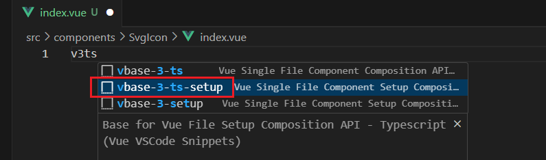

 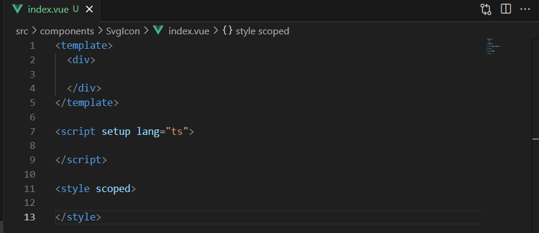

## 集成element-plus

硅谷甄选运营平台,UI组件库采用的element-plus，因此需要集成element-plus插件

> 官网地址：https://element-plus.gitee.io/zh-CN/

- 【步骤一】

```
pnpm install element-plus
pnpm install  @element-plus/icons-vue   // element-plus提供的所有图标组件库
```

- 【步骤二】

> 本项目是根据官网来的 完整引入

**入口文件main.ts全局安装element-plus,element-plus默认支持语言英语设置为中文**

```typescript
// main.ts
import { createApp } from 'vue'
import ElementPlus from 'element-plus'
import 'element-plus/dist/index.css'
import App from './App.vue'

const app = createApp(App)

app.use(ElementPlus)
app.mount('#app')
```

- 【步骤三】

在组件中引入图标组件并使用

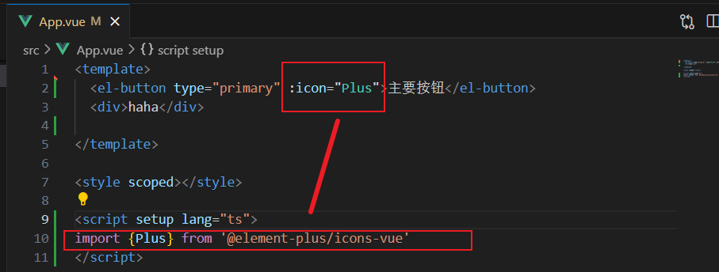

### 【问题】Failed to resolve import "@element-plus/icons.

```
[plugin:vite:import-analysis] Failed to resolve import "@element-plus/icons.
```

这个问题是因为没有引入element-plus/icons-vue ，执行一下这个：```pnpm install @element-plus/icons-vue``。

我是因为项目卡了…没反应过来，重启一下就好了。

- 【步骤四】国际化（中文版）配置

```typescript
import ElementPlus from 'element-plus'
import zhCn from 'element-plus/es/locale/lang/zh-cn'

app.use(ElementPlus, {
  locale: zhCn,
})
```

> 硅谷甄选视频里，国际化配置之后打包失败。但是今年2024年6月26日，我是打包成功了的
>
> 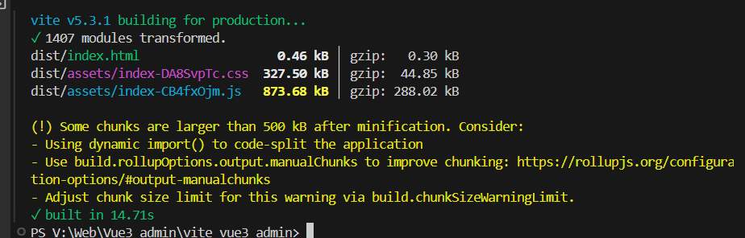

## src别名的配置

在开发项目的时候文件与文件关系可能很复杂，因此我们需要给src文件夹配置一个别名

```typescript
// vite.config.ts
import {defineConfig} from 'vite'
import vue from '@vitejs/plugin-vue'

import path from 'path'  //node提供的模块，可以获取某个文件或者文件夹的路径
export default defineConfig({
    plugins: [vue()],
    resolve: {
        alias: {
            "@": path.resolve("./src") // 相对路径别名配置，使用 @ 代替 src
        }
    }
})
```

**TypeScript 编译配置**

```json
// 注意注意注意这里要写到 tsconfig.app.json里面
{
  "compilerOptions": {
    "baseUrl": "./", // 解析非相对模块的基地址，默认是当前目录
    "paths": { //路径映射，相对于baseUrl
      "@/*": ["src/*"] 
    }
  }
}
```

 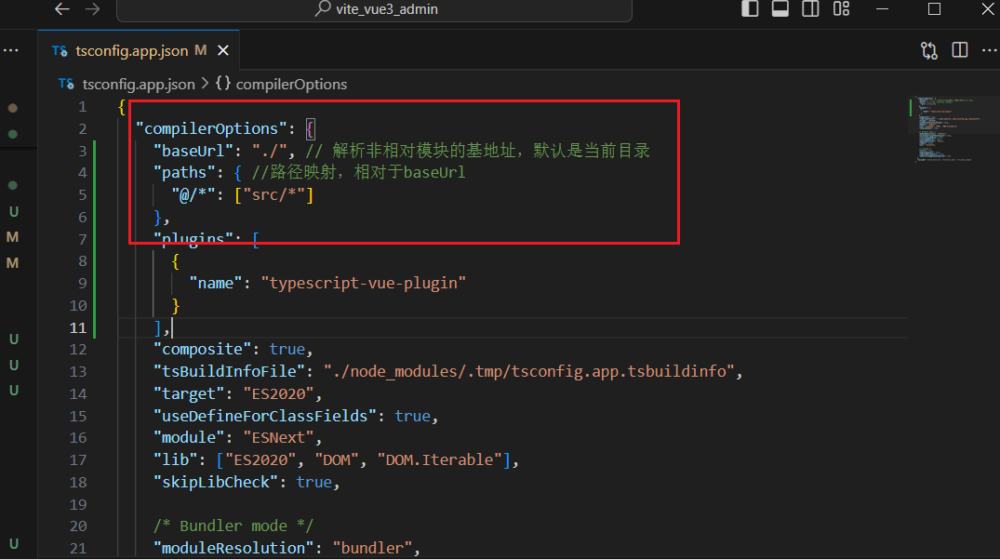

> 硅谷甄选视频这一段写在tsconfig.json中，是因为当时他用vite创建时，没有 tsconfig.app.json，只有tsconfig.json一个文件。
>
> 我是有三个的：应该是版本更新了，把原来的文件拆成这三份，要写在对应的地方
>
>   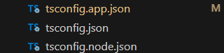

### 【问题】找不到path类型声明 

但是可以正常使用

 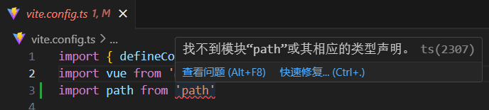

解决方法：关闭VS code重新打开就好了

### 【问题】找不到模块"@/App.vue"

 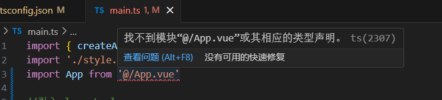

第一次尝试解决：关闭VS code重新打开。

> 太天真了…其实还是报错。它可以用，但报错，有红色波浪线

- 打包的时候发现错误 error TS2307。打包的时候有错！问题非常大

```
src/App.vue:12:21 - error TS2307: Cannot find module '@/components/SvgIcon/index.vue' or its corresponding type declarations.

12 import SvgIcon from '@/components/SvgIcon/index.vue'
                       ~~~~~~~~~~~~~~~~~~~~~~~~~~~~~~~~


Found 1 error.

 ELIFECYCLE  Command failed with exit code 2.
```

第二次尝试解决：我跟着这个博客，两个方案都试了，但是都不可以

> https://blog.csdn.net/weixin_52645312/article/details/135707081

- **<font color="red">最终解决方案：</font>**

src别名的配置的时候，我把下面这一段写在tsconfig.json中，但是新的vite把这个文件拆成了三个，①tsconfig.app.json②tsconfig.json③tsconfig.node.json，要把这一段写在**tsconfig.app.json**中才会生效！

```json
{
  "compilerOptions": {
    "baseUrl": "./", // 解析非相对模块的基地址，默认是当前目录
    "paths": { //路径映射，相对于baseUrl
      "@/*": ["src/*"] 
    }
  }
}
```

## 环境变量的配置

**项目开发过程中，至少会经历开发环境、测试环境和生产环境(即正式环境)三个阶段。不同阶段请求的状态(如接口地址等)不尽相同，若手动切换接口地址是相当繁琐且易出错的。于是环境变量配置的需求就应运而生，我们只需做简单的配置，把环境状态切换的工作交给代码。**

- 开发环境（development）
  顾名思义，开发使用的环境，每位开发人员在自己的dev分支上干活，开发到一定程度，同事会合并代码，进行联调。

- 测试环境（testing）
  测试同事干活的环境，一般会由测试同事自己来部署，然后在此环境进行测试

- 生产环境（production）
  生产环境是指正式提供对外服务的，一般会关掉错误报告，打开错误日志。(正式提供给客户使用的环境。)

注意：一般情况下，一个环境对应一台服务器,也有的公司开发与测试环境是一台服务器！！！

**【操作】**

项目**根目录**分别添加 开发、生产和测试环境的文件!

```
.env.development
.env.production
.env.test
```

 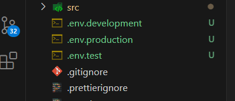

**文件内容**

注意：变量必须以 VITE_ 为前缀才能暴露给外部读取

```
# 变量必须以 VITE_ 为前缀才能暴露给外部读取
NODE_ENV = 'development'
VITE_APP_TITLE = 'vite-vue3-admin'
VITE_APP_BASE_API = '/dev-api'
```

```
NODE_ENV = 'production'
VITE_APP_TITLE = 'vite-vue3-admin'
VITE_APP_BASE_API = '/prod-api'
```

```
# 变量必须以 VITE_ 为前缀才能暴露给外部读取
NODE_ENV = 'test'
VITE_APP_TITLE = 'vite-vue3-admin'
VITE_APP_BASE_API = '/test-api'
```

**配置运行命令：package.json**

```
 注意我这里加注释是为了更好地学习，这个 .json文件中不能有格式哈
 "scripts": {
    "dev": "vite --open",
    "build:test": "vue-tsc && vite build --mode test", //测试环境打包
    "build:pro": "vue-tsc && vite build --mode production", //生产环境打包
  },
```

<font color="red">**通过 import.meta.env 获取环境变量**</font>

```
console.log( import.meta.env );
```

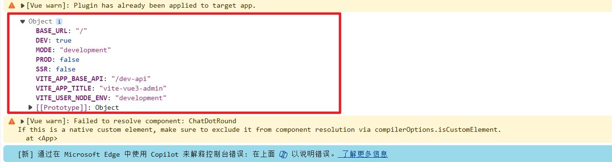

## SVG图标配置

在开发项目的时候经常会用到svg矢量图，而且我们使用SVG以后，页面上加载的不再是图片资源,

这对页面性能来说是个很大的提升，而且我们SVG文件比img要小的很多，放在项目中几乎不占用资源。

> 阿里图标库 https://www.iconfont.cn/

**【步骤一】安装SVG依赖插件**

```
pnpm install vite-plugin-svg-icons -D
```

**【步骤二】在`vite.config.ts`中配置插件**

```typescript
import { createSvgIconsPlugin } from 'vite-plugin-svg-icons' // SVG需要用的插件
import path from 'path'
export default () => {
  return {
    plugins: [
      createSvgIconsPlugin({
        // Specify the icon folder to be cached
        iconDirs: [path.resolve(process.cwd(), 'src/assets/icons')],
        // Specify symbolId format
        symbolId: 'icon-[dir]-[name]',
      }),
    ],
  }
}
```

**【步骤三】入口文件 main.ts 导入**

```
import 'virtual:svg-icons-register'
```

**【步骤四】组件中使用图标**

在 src/assets下创建 icons文件夹，新建一个admin.svg文件。然后把svg代码复制到该文件中。

```vue
svg图标外层容器节点，内部需要与use标签结合使用
<svg>
  xlink:href执行哪一个图标，href后面规定必须 #icon-
  <use xlink:href="#icon-phone"></use>
</svg>  

icon-后面的名字与 asset/icons/phone.svg  同名
大小可以通过 <svg style="width:30px; height:30px"> 调整
```

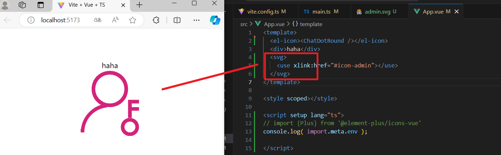

```html
//调整svg的宽高
<svg style="width:30px; height:30px">
  <use xlink:href="#icon-phone"></use>
</svg>  
```

### svg封装为组件

因为项目很多模块需要使用图标,因此把它封装为组件

**在src/components目录下创建一个SvgIcon组件:代表如下（用到父->子传递数据props）**

- <font color="Red">**src/components/SvgIcon/index.vue**</font>

```vue
<template>
  <div>
    <svg :style="{ width: width, height: height }">
      <use :xlink:href="prefix + name" :fill="color"></use>
    </svg>
  </div>
</template>

<script setup lang="ts">
defineProps({
  //xlink:href属性值的前缀
  prefix: {
    type: String,
    default: '#icon-'
  },
  //svg矢量图的名字
  name: String,
  //svg图标的颜色
  color: {
    type: String,
    default: ""
  },
  //svg宽度
  width: {
    type: String,
    default: '16px'
  },
  //svg高度
  height: {
    type: String,
    default: '16px'
  }

})
</script>
<style scoped></style>
```

如果组件被使用：（使用者是父组件）

 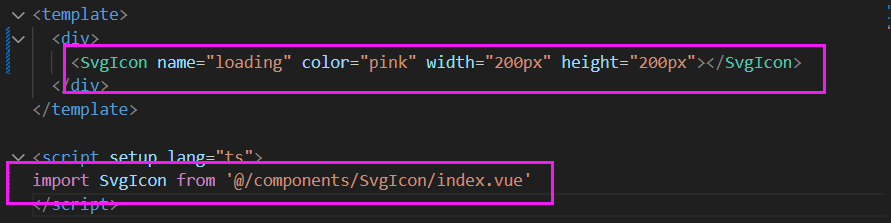

### 【问题】Cannot find module 'vue'

> Cannot find module 'vue'. Did you mean to set the 'moduleResolution' option to 'node', or to add aliases to the 'paths' option?Vetur(2792)

解决方法：https://blog.csdn.net/qq_61798306/article/details/132241430

将 "moduleResolution": "bundler"改成"moduleResolution": "node"

 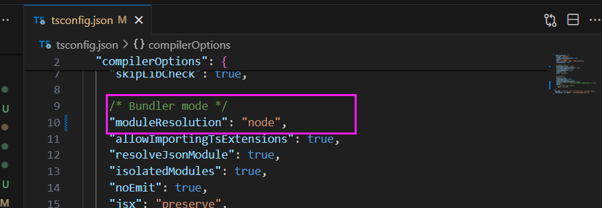

### 【问题】 Module ’XXX.vue‘ has no default export.Vetur(1192)

 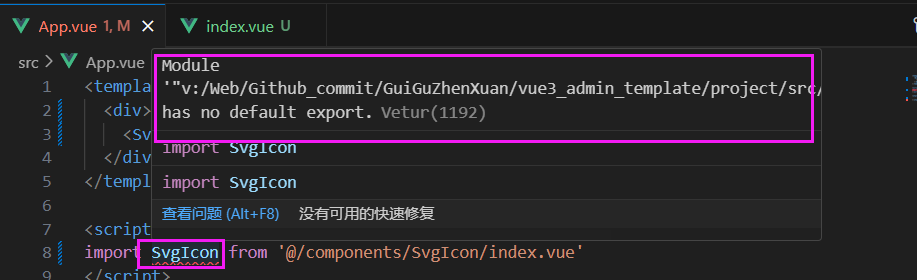

> 解决文章：https://www.jb51.net/javascript/2880799bw.htm

**原因**：`vetur`是一个`vscode`插件，用于为`.vue`单文件组件提供代码高亮以及语法支持。那既然官方推荐 _volar_，简单的说`volar`是`vetur`的升级版本，提供了更好的功能并有更好的TS支持。

**解决**：禁用 vetur就可以了

### svg封装为全局组件

因为项目很多模块需要使用图标,因此把它封装为全局组件。应该是在入口文件 main.ts 注册 app.component()使用。但是一个项目中的全局组件可能有非常多，所以不要全部写在 main.ts 中。

- 利用自定义插件把组件都变成全局组件

**【自定义插件语法】**

在components 文件夹目录下创建一个index.ts文件：用于注册components文件夹内部全部全局组件！！！

 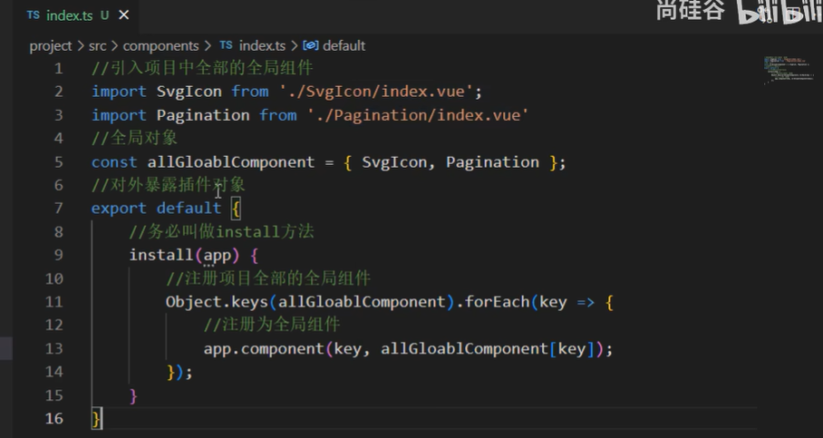

```typescript
// 引入项目中全部的全局组件
import SvgIcon from './SvgIcon/index.vue';
// 自定义类型
import type { App, Component } from 'vue';
// 把所有组件放进一个对象components中
const components: { [name: string]: Component } = { SvgIcon };

// 对外暴露插件对象
export default {
    // 务必叫做install方法
    // 注册项目全部的全局组件
    install(app: App) { // 会把app应用实例注入进来
        Object.keys(components).forEach((key: string) => {
            // 注册为全局组件
            app.component(key, components[key]);
        })
    }
}
```

- 在入口文件 main.ts 引入src/index.ts文件,通过app.use方法安装自定义插件

```typescript
import gloablComponent from './components/index';
app.use(gloablComponent);
```

当app.use运行时，会触发index.tx里的install方法

## 集成sass

我们目前在组件内部已经可以使用scss样式,因为在配置styleLint工具的时候，项目当中已经安装过sass sass-loader,因此我们再组件内可以使用scss语法！！！**需要加上lang="scss"**

```vue
<style scoped lang="scss"></style>
```

- **接下来我们为项目添加一些全局的样式（清除默认样式）**

【步骤一】

在src/styles目录下创建 index.scss、reset.scss文件。

 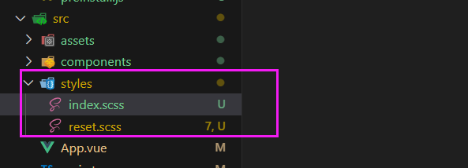

【步骤二】

在npm官网https://www.npmjs.com/ 中搜索 reset scss （搜索出来的应该是scss-reset）

> https://www.npmjs.com/package/scss-reset?activeTab=code

把代码复制粘贴到 reset.scss中

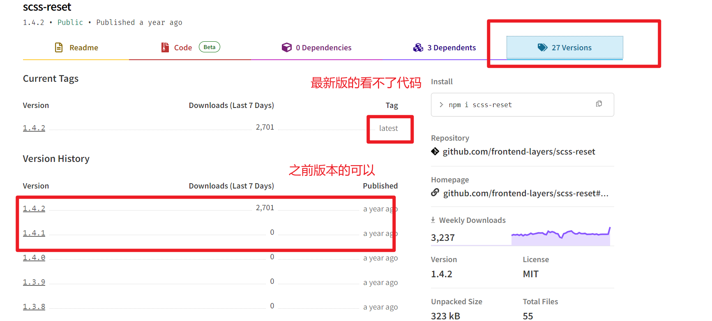

【步骤三】

在index.scss引入reset.scss

```typescript
// 在css中@import是导入css样式表，这种方式通常会在css文件中使用
@import './reset.scss'
```

【步骤四】在入口文件 main.ts 引入

```typescript
// 引入模板的全局样式
import '@/styles/index.scss'
```

**但是你会发现在src/styles/index.scss全局样式文件中没有办法使用$变量（scss中原本可以用 $xxx设置全局变量）。因此需要给项目中引入全局变量$.**

【步骤五】在styles/variable.scss创建一个variable.scss文件！

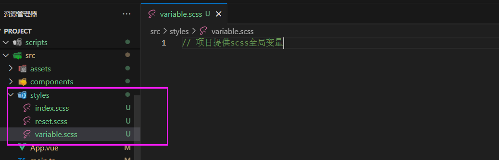

【步骤六】在vite.config.ts文件配置如下:

```typescript
export default defineConfig(({command})=>{
  return {
    plugins: [
      vue(),
      createSvgIconsPlugin({
        iconDirs: [path.resolve(process.cwd(), 'src/assets/icons')],
        symbolId: 'icon-[dir]-[name]',
      })
    ],
    resolve: {
      alias: {
          '@': path.resolve('./src') // 相对路径别名配置，使用 @ 代替 src
      }
    },
    //scss全局变量的配置
    css: {
      preprocessorOptions: {
        scss: {
          javascriptEnabled: true,
          additionalData: '@import "./src/styles/variable.scss";',
        },
      },
    }
  }
})

```

**`@import "./src/styles/variable.scss";`后面的`;`不要忘记，不然会报错**!

配置完毕你会发现scss提供这些全局变量可以在组件样式中使用了！！！

【步骤七】使用

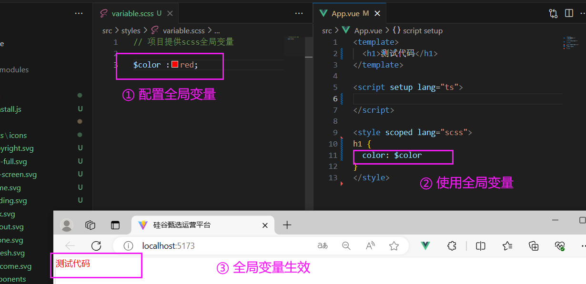

## mock数据

> 官网 ：https://www.npmjs.com/package/vite-plugin-mock
>
> 注意mock只在开发阶段有用，上线就没有用了

【步骤一】

如果要保持和B站视频硅谷甄选一致，根据弹幕提示，后续需要用到 的版本为 2.9.6 https://www.npmjs.com/package/vite-plugin-mock/v/2.9.6

```
pnpm install -D vite-plugin-mock@2.9.6 mockjs
//vite-plugin-mock、mockjs
```

【步骤二】在 vite.config.js 配置文件启用插件。

```typescript
import { viteMockServe } from 'vite-plugin-mock'

export default defineConfig({ command })=> {
  return {
    plugins: [
      viteMockServe({
        localEnabled: command === 'serve',
      }),
    ],
  }
}
```

【步骤三】在根目录创建mock文件夹:去创建我们需要mock数据与接口！！！

【步骤四】在mock文件夹内部创建一个user.ts文件

createUserList 函数：每次执行都会返回一个数组，数组里面包含两个用户信息

文件export default对外暴露一个数组，数组里面包含两个接口

① 登录假的接口

② 获取用户信息的假的接口

```typescript
//用户信息数据
function createUserList() {
    return [
        {
            userId: 1,
            avatar:
                'https://wpimg.wallstcn.com/f778738c-e4f8-4870-b634-56703b4acafe.gif',
            username: 'admin',
            password: '111111',
            desc: '平台管理员',
            roles: ['平台管理员'],
            buttons: ['cuser.detail'],
            routes: ['home'],
            token: 'Admin Token',
        },
        {
            userId: 2,
            avatar:
                'https://wpimg.wallstcn.com/f778738c-e4f8-4870-b634-56703b4acafe.gif',
            username: 'system',
            password: '111111',
            desc: '系统管理员',
            roles: ['系统管理员'],
            buttons: ['cuser.detail', 'cuser.user'],
            routes: ['home'],
            token: 'System Token',
        },
    ]
}

export default [
    // 用户登录接口
    {
        url: '/api/user/login',//请求地址
        method: 'post',//请求方式
        response: ({ body }) => {
            //获取请求体携带过来的用户名与密码
            const { username, password } = body;
            //调用获取用户信息函数,用于判断是否有此用户
            const checkUser = createUserList().find(
                (item) => item.username === username && item.password === password,
            )
            //没有用户返回失败信息
            if (!checkUser) {
                return { code: 201, data: { message: '账号或者密码不正确' } }
            }
            //如果有返回成功信息
            const { token } = checkUser
            return { code: 200, data: { token } }
        },
    },
    // 获取用户信息
    {
        url: '/api/user/info',
        method: 'get',
        response: (request) => {
            //获取请求头携带token
            const token = request.headers.token;
            //查看用户信息是否包含有次token用户
            const checkUser = createUserList().find((item) => item.token === token)
            //没有返回失败的信息
            if (!checkUser) {
                return { code: 201, data: { message: '获取用户信息失败' } }
            }
            //如果有返回成功信息
            return { code: 200, data: {checkUser} }
        },
    },
]
```

【步骤五】**安装axios**

```
pnpm install axios
```

【步骤六】测试

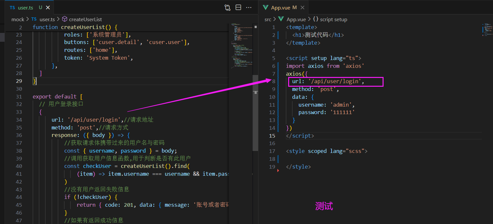

## axios二次封装

> 官网 http://www.axios-js.com/zh-cn/docs/#%E6%8B%A6%E6%88%AA%E5%99%A8

在开发项目的时候避免不了与后端进行交互,因此我们需要使用axios插件实现发送网络请求。在开发项目的时候

我们经常会把axios进行二次封装。

目的:

1:使用请求拦截器，可以在请求拦截器中处理一些业务(开始进度条、请求头携带公共参数)

2:使用响应拦截器，可以在响应拦截器中处理一些业务(进度条结束、简化服务器返回的数据、处理http网络错误)

- 在根目录下创建utils/request.ts

```typescript
import axios from "axios";
import { ElMessage } from "element-plus";
//【第一步】 利用axios对象的create方法。去创建axios示例，是为了方便有其他的配置
//创建axios实例
let request = axios.create({
    // 基础路径
    baseURL: import.meta.env.VITE_APP_BASE_API,  // 基础路径会携带VITE_APP_BASE_API
    timeout: 5000 // 设置超时的时间
})
//【第二步】请求拦截器
request.interceptors.request.use(config => {
    /*
      这里在发送请求之前做些什么
      config配置对象里面有一个 headers属性请求头，经常给服务器端携带公共参数
    */
    return config; //返回配置对象
});
//【第三步】响应拦截器
// request.interceptors.response.use(第一个函数,第二个函数)
// 第一个函数是响应成功  第二个函数是响应失败
request.interceptors.response.use((response) => {
    // 这里接上一节 mock，
    return response.data;
}, (error) => {
    //处理网络错误
    let msg = '';
    let status = error.response.status;
    switch (status) {
        case 401:
            msg = "token过期";
            break;
        case 403:
            msg = '无权访问';
            break;
        case 404:
            msg = "请求地址错误";
            break;
        case 500:
            msg = "服务器出现问题";
            break;
        default:
            msg = "无网络";

    }
    //提示错误信息
    ElMessage({
        type: 'error',
        message: msg
    })
    return Promise.reject(error);
});

// 对外暴露
export default request;
```

### 测试

使用axios

App.vue

```typescript
import myaxios from '@/utils/request'
import { onMounted } from 'vue';

onMounted(()=>{
  myaxios({
    url: '/user/login', // 本来根据mock指定的路径 是/api/user/login,但axios拦截器中做了设置
    method: 'post',
    data: {
      username: 'admin',
      password: '111111'
    }
  }).then(res =>{
    console.log(res);
  })
})
```


## API接口统一管理

在开发项目的时候，接口可能很多需要统一管理。

【步骤一】在src目录下去创建api文件夹去统一管理项目的接口；

 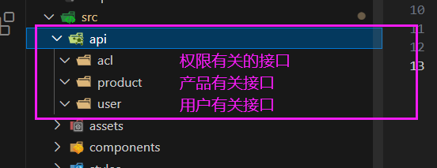

【步骤二】以 /src/user 用户有关接口为例讲解

 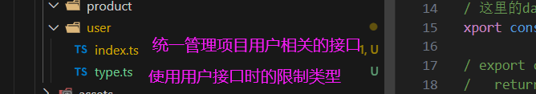

【type.ts】

```typescript
// 登录接口需要携带的参数的TS类型
export interface loginForm {
  username: String,
  password: String
}
/*************************************** */

interface dataTYpe{
  token: String
}

// 登录接口返回的数据类型
export interface loginResponseData{
  code: number,
  data: dataTYpe
}
/*************************************** */
interface userInfo {
  userId: number,
  avatar: string,
  username: string,
  password: string,
  desc: string,
  roles: string[],
  buttons: string[],
  routes: string[],
  token: string,
}

interface user {
  checkUser:userInfo
}

// 定义服务器返回用户信息相关的数据类型
export interface userResponseData {
  code: number,
  data: user
}
```

【index.ts】

```typescript
// 统一管理咱们项目用户相关的接口
import myaxios from '@/utils/request'
// 引入TS类型
import type {loginForm,loginResponseData,userResponseData} from './type'

// 统一管理接口
// 这里是按照mock中的规范进行书写的
enum API {
  LOGIN_URL = '/user/login',
  USERINFO_URL = '/user/info'
}
// 暴露请求函数
// (1)登录接口方法  
// 这里的data是用户数据，包括账号与密码
export const reqLogin = (data:loginForm) => myaxios.post<any,loginResponseData>(API.LOGIN_URL)

// export const reqLogin = function(data) {
//   return myaxios.post(API.LOGIN_URL)
// }

//(2)获取用户信息接口方法
export const reqUserInfo = () => myaxios.get<any,userResponseData>(API.USERINFO_URL)
```

### 【问题】

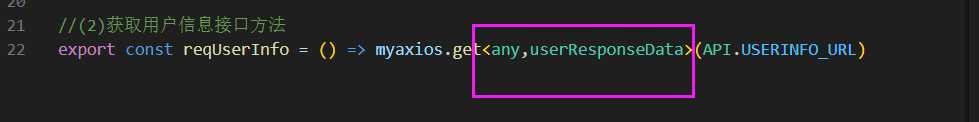

目的为了限制获得的用户信息，但不明白为什么要这么写↑