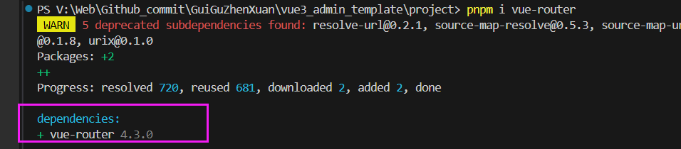
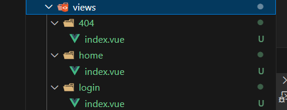

# 路由

- 分析

四个路由

1、一级路由：登录

2、一级路由：展示数据

3、404路由

4、任意路由：指向404

- 【步骤1】安装

```
pnpm i vue-router 
```

 

- 【步骤2】新建文件夹 /src/views 放置路由

 

- 【步骤3】/src/router/index.ts

模板路由配置、新建router

- 【步骤4】在 main.ts 中配置

```typescript
import { createApp } from 'vue'
import router from './router'
// createApp(App).mount('#app')

const app = createApp(App) //获取实例对象

app.use(router)

app.mount('#app') // 将应用挂载
```

- 【步骤5】App.vue 设置一个可见区域

```
<router-view></router-view>
```

- 【步骤6】检测路由