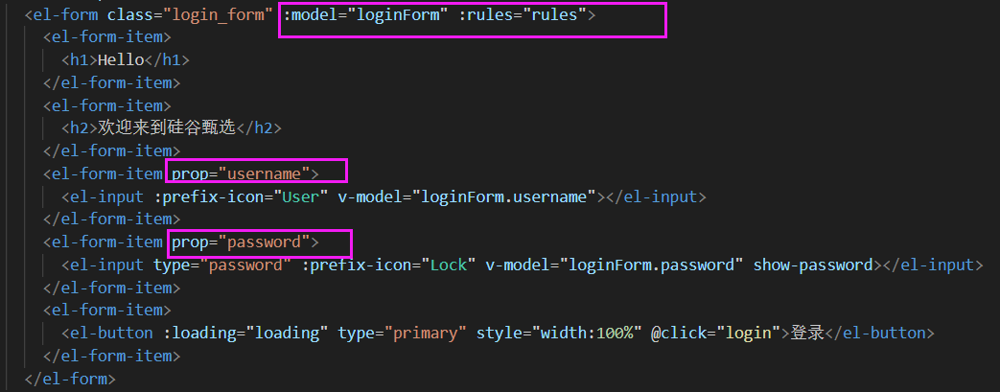
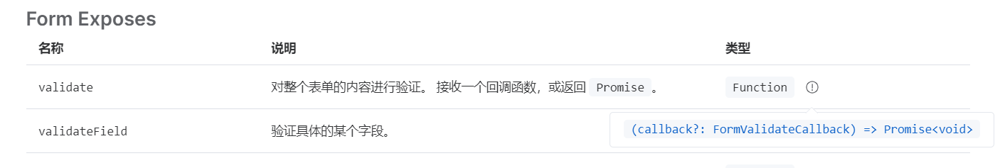
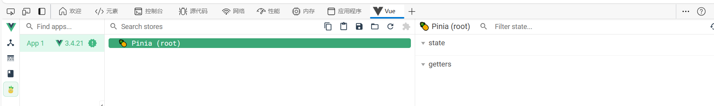
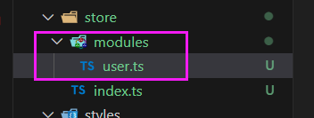
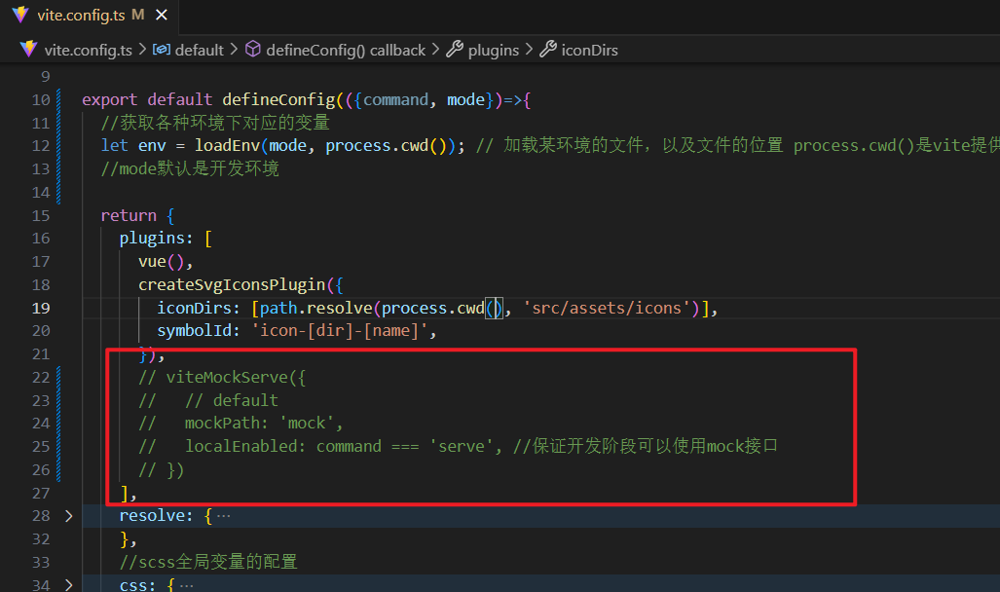
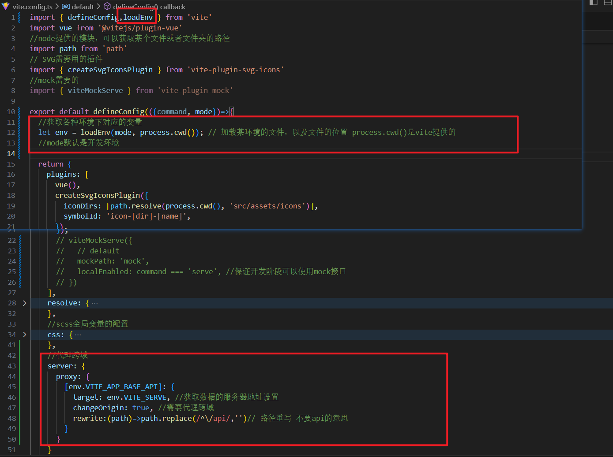
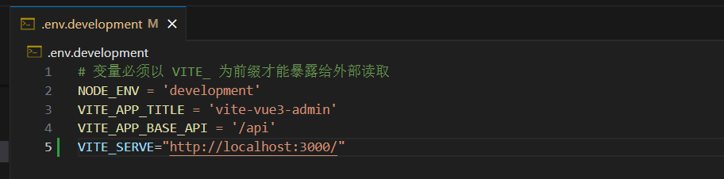
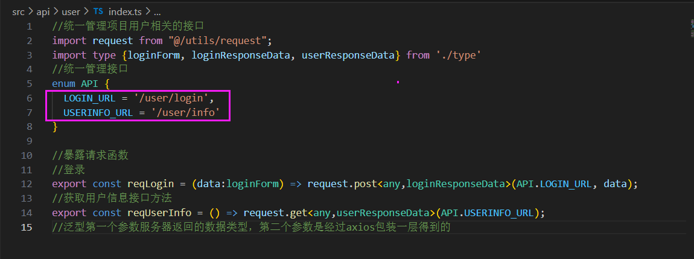

# 登录

```
静态页面搭建
  布局24分栏 el-row el-col
  el-form的使用
```


## 静态页面

### 布局

**布局通过 el-row   el-col实现**

基础的 24 分栏。宽度<768px的时候，左侧就消失:xs="0"

```html
<template>
  <div class="login_container">
    <el-row>
      <el-col :span="12" :xs="0">左侧</el-col>
      <el-col :span="12" :xs="24">右侧</el-col>
    </el-row>
  </div>
</template>
```

### 表单

- el-form中的每一个元素都要用 ```<el-form-item>```包裹

- 使用了 el-input的话，需要绑定响应式数据页面才能够输入，否则不能输入。

  vue3响应式数据用ref reactive

- el-form是` :model` 但el-input是 `v-model`，一个是elementplus提供的，一个是v-model

```html
<el-form :model="loginForm">
  <el-form-item>
    <el-input v-model="loginForm.username"></el-input>
  </el-form-item>
  <el-form-item>
    <el-input v-model="loginForm.password" type="password"></el-input>
  </el-form-item>
</el-form>

import { reactive } from 'vue';
let loginForm = reactive({username:'admin', password:'111111'}) 
```

- el-input 如果想要图标，要引入使用 import {User, Lock} from '@element-plus/icons-vue'

 ```:prefix-icon="Lock"```

```html
<el-form :model="loginForm">
  <el-form-item>
    <el-input :prefix-icon="User" v-model="loginForm.username"></el-input>
  </el-form-item>
  <el-form-item>
    <el-input :prefix-icon="Lock" v-model="loginForm.password" type="password"></el-input>
  </el-form-item>
</el-form>
```

### 背景图片

在CSS中加

```
background: url("@/assets/images/background.jpg"); // 不是background-image
background-size: cover; // 图片保持比例放大或缩小使X轴Y轴都铺满整个容器，但图片超出容器部分会被剪裁掉，图片不变形。
```

宽高

```
width: 100%;
height: 100vh;
vh，是指CSS中相对长度单位，表示相对视口高度（Viewport Height），1vh = 1% * 视口高度
```

margin

```
margin: 20px 0px; 
// 四个数：顺时针排序：上，右，下，左。
// 两个数：上下 左右
```

### 表单检验

> elementUI

- el-form

属性model：表单数据收集到哪个对象身上

属性rules：按照什么规则收集。

需要校验的 el-form-item身上都需要加一个 prop



```typescript
const rules ={
  username:[
    //required表示这个字段必须校验
    { required: true, message: '用户名不能为空', trigger: 'blur' },
    { required: true, min: 3, max: 5, message: '账号长度至少3位', trigger: 'change' }
  ],
  password:[
    { required: true, min: 3, max: 10, message: '密码长度至少3位', trigger: 'change' }
  ]
}
```

- 表单校验通过之后才可以提交（通过 Form表单中的 validate函数）



```
//保证全部表单项校验通过再发请求
<el-form ref="loginForms">

let loginForms = ref()
await loginForms.value.validate() //保证全部表单项校验通过再发请求
```

#### 自定义校验规则

```typescript
function validatorUserName(rule: any, value: any, callback: any) {
  // rule: 校验规则对象
  // value：表单元素文本内容
  // callback：回调函数，如果符合条件就通过callback放行。如果不符合条件，callback注入错误信息
  if(value.length >= 3){
    callback();
  } else {
    callback(new Error('账号长度至少3位'))
  }
}

const rules ={
  username:[
    { required: true, trigger: 'change', validator: validatorUserName }
  ]
}
```

 

## 登陆业务

### pinia环境搭建

登录页面的逻辑：点击登录按钮，登陆成功后跳转页面。因为登陆成功的TOKEN以后发请求时都用得到，所以存储在仓库pinia里。在仓库（pinia）中编写登录逻辑。且用到api中的接口。仓库用来实现接收&返回给页面数据的逻辑，也用来与接口进行交接。

登录成功后：①token保存②跳转页面③成功显示信息ELNotification显示信息”登录成功“+登陆时间

**发请求 接收数据 ，统一在仓库中实现（pinia/vuex）**

【步骤一】引入、创建pinia并配置好

```
pnpm i pinia
```

创建文件夹 /src/store/index.ts

```typescript
import {createPinia} from 'pinia'
// 创建大仓库
let pinia = createPinia()

//对外暴露，入口文件需要安装仓库
export default pinia
```

入口文件main.ts引入 

```typescript
import pinia from './store'
app.use(pinia)
```



此步骤结束，环境中有 pinia了

【步骤二】

创建用户仓库

 

```typescript
// 创建用户相关的小仓库
import {defineStore} from 'pinia'

let useUserStore = defineStore('User', {略})
// 对外暴露获取小仓库的方法
export default useUserStore
```

在组件中使用：

```typescript
import useUserStore from '@/store/modules/user'
let userStore = useUserStore()
```

### pinia数据

**<font color="red">用户相关的小仓库 中的数据</font>**

- **state**
  保存token

因为在后续的页面中，onMounted发送请求，需要带上token，所以token要存放在仓库中，而且pinia没有持久化，所以我们借助了localStorage。并且把SET_TOKEN、GET_TOKEN封装到utils文件夹中，作为可以调用的工具包。

- **actions** ：userLogin

```javascript
  actions: {
    async userLogin(data: loginForm) {
      let result:loginResponseData = await reqLogin(data)
      if(result.code == 200) {
        this.token = (result.data.token as string);
        SET_TOKEN((result.data.token as string))
        return 'ok'
      } else {
        return Promise.reject(new Error(result.data.message)) 
      }
    }
  }
```

这个函数的参数是需要ts定义数据类型的，所以我们使用到之前做api时定义的类型。

① 引入api接口中的ts类型

② 在当前目录下定义token的数据类型

③ 引入api接口`reqLogin` 与接口进行交接。API中实现与后端的交互。


登录页面提供了【登录】按钮，点击按钮，执行回调函数login，login调用用户仓库提供的函数 userLogin，调用api提供的接口。注意：Login.vue中就算调用了userLogin也不知道是成功还是失败，因为没有返回值，怎么返回？答：因为userLogin是一个async函数（等待api接口成功），所以它的返回值是一个promise对象。（登陆成功，return 'ok'；登录失败，return Promise.reject(new Error(result.data.message))）

跳转首页：

```javascript
import { useRouter, useRoute } from 'vue-router';
let $router = useRouter();
$router.push({ path: redirect || '/' });
```

显示信息”登录成功“+登陆时间

## 前后端数据是怎么打通的

- 没开发后端时，数据用mock

如果想配置代理，把这一块的mock注释掉即可



### 完整路径

开发了后端，前端配置代理 借助vite

vite提供了 loadEnv process.cwd()



vite代理后，axios发送请求的完整网址是，

`env.development` 里的 VITE_SERVE + VITE_APP_BASE_API + 路径

以下面的设置为例，完整路径为：http://localhost:3000/api/user/login但是由于vite代理的时候 rewrite了，这一行的意思是去掉api，那么完整路径是要去掉api的





### 点击登陆后路径怎么来的

登陆按钮在login/index.vue中，点击后的回调函数调用pinia仓库（user仓库）提供的登录接口userLogin，同时传递数据过去。

仓库中的userLogin，是调用了api接口的方法

api接口使用的axios是经过二次封装之后的，axios有基本路径baseURL（源自env.development），以及请求路径（仓库调用时传参）。

此时的路径是/api/user/login。发送请求时，通过vite代理，在前面加上env.VITE_SERVE，同时rewrite。

- 想一下nginx配置怎么弄

## 页面跳转

permission.js 全局守卫，页面每跳转一次都验证token是否有效

### 登陆时间

登录成功之后的 早上好/下午好/晚上好。

思路：封装一个函数，获取一个结果：当前是上午/下午/晚上，通过内置函数Date。放在utils下面。

- 提示信息

```javascript
import { ElNotification } from 'element-plus';

    ElNotification({
      type: 'success',
      message: '欢迎回来',
      title: `HI,${getTime()}好`
    });
```

