# layout组件

> vite_vue3_admin\src\layout\index.vue
>
> layout组件，是整个首页的主要框架

## 静态搭建

```html
<template>
  <div class="layout_container">
    <!-- 左侧导航 -->
    <div class="layout_nav"></div>
    <!-- 左侧菜单 -->
    <div class="layout_menu">123</div>
    <!-- 右侧顶部 -->
    <div class="layout_tabbar">456</div>
    <!-- 右侧主内容 -->
    <div class="layout_main">789</div>
  </div>
</template>

<style scoped lang="scss">
.layout_container {
  width: 100%;
  height: 100vh;
  display: flex;
  .layout_nav {
    width: $base_nav_width;
    height: 100vh;
    background-color: $base-menu-background; 
  }
  .layout_menu {
    width: $base-menu-width;
    height: 100vh;
    background-color: grey;
  }
  .layout_tabbar {
    width: calc(100% - $base-menu-width - $base_nav_width);
    height: $base-tabbar-height;
    background-color: blue;
    position: fixed;
    top: 0;
    right: 0;
  }
  .layout_main {
    width: calc(100% - $base-menu-width - $base_nav_width);
    height: calc(100vh - $base-tabbar-height);
    background-color: yellow;
    position: fixed;
    top: $base-tabbar-height;
    right: 0;
    padding: 20px;
    overflow: auto; /*防止main中的元素溢出*/
  }
}
</style>
```

（1）菜单栏宽高、颜色，可以放在公共的scss文件中

```css
//左侧导航宽度
$base_nav_width: 60px;
// 左侧菜单宽
$base-menu-width: 200px;
// 左侧导航的背景颜色
$base-menu-background: #001529;
//顶部导航高度
$base-tabbar-height: 70px
```

（2）CSS中的宽度可以计算得到

```css
width: calc(100% - $base-menu-width);
```

（3）防止layout_main溢出

```css
.layout_main {
    padding: 20px; /*内边距*/
    overflow: auto; /*防止main中的元素溢出*/
  }
```

- 效果展示

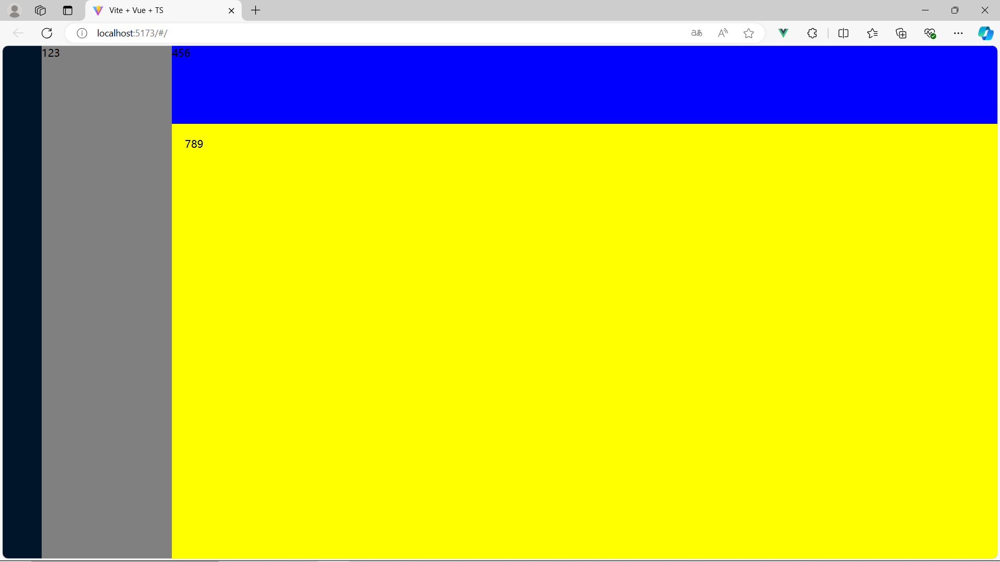

## 滚动条样式

- src\styles\index.scss

```css
::-webkit-scrollbar {
  width: 8px;
}

::-webkit-scrollbar-track {
  background: $main-bgc;
}

::-webkit-scrollbar-thumb {
  width: 8px;
  background-color: $scrollbar-static-color;
  border-radius: 8px;
}

::-webkit-scrollbar-thumb:hover {
  background-color: $scrollbar-hover-color;
}
```

## 组件

### ①Logo组件封装

- vite_vue3_admin\src\setting.ts

项目的标题和LOGO单独摘出到 setting.ts

### ②Menu左侧菜单

#### 静态搭建

element UI

```vue
<template>
//background-color菜单背景颜色
//text-color文本颜色 
//index作为el-menu-item的唯一标识
        <el-menu background-color="#001529" text-color="white"> 
          <el-menu-item index="1">首页</el-menu-item>
          <el-menu-item index="2">数据大屏</el-menu-item>
          <!-- 折叠菜单 -->
          <el-sub-menu index="3">
            <!-- 这个是具名插槽 -->
            <template #title>权限管理</template>
            <el-menu-item index="3-1">用户管理</el-menu-item>
            <el-menu-item index="3-2">角色管理</el-menu-item>
            <el-menu-item index="3-3">菜单管理</el-menu-item>
          </el-sub-menu>
        </el-menu>
</template>
```

菜单去除边框

```
.el-menu {
  border: 0!important;
  padding: 20px;
}
```


#### 菜单-递归组件

**路由是一个数组，我们的菜单要通过遍历路由数组得到。**

如果没有子路由，使用一级菜单；如果只有一个子路由，使用一级菜单；如果有多个子路由，用下拉菜单。

【步骤一】提取出组件 src\layout\index.vue

```html
<el-menu background-color="#00000" text-color="rgb(81,90,110)"> 
   <!-- 根据路由动态生成 -->
   <Menu></Menu>
</el-menu>

import Menu from './menu/index.vue'
```

【步骤二】把路由存储在用户仓库（src\store\modules\user.ts）中，这样所有组件都可以访问到了！

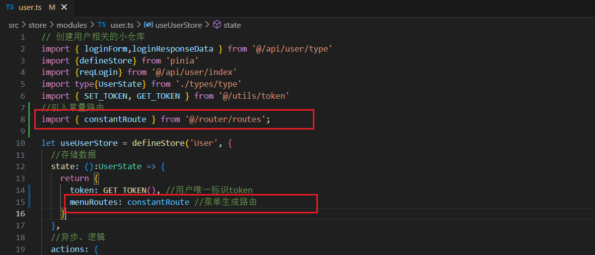

- src\store\modules\types\type.ts 这里需要定义路由的TS类型（数组，数组中放了路由对象），感谢路由对象，它提供了路由的类型定义

  ```javascript
  import type { RouteRecordRaw } from "vue-router"
  //小仓库对象类型
  export interface UserState {
    token: string|null,
    menuRoutes: RouteRecordRaw[]
  }
  ```

【步骤三】在路由定义文件中，加上meta路由元信息，定义该路由对应的标题

```javascript
  {
    path: '/:pathMatch(.*)*',
    redirect: '/404',
    name: 'any', //命名路由
    meta: {
      title: 'any'
    }
  }
```

【步骤四】组件中获取用户相关的小仓库

- layout组件：src\layout\index.vue

```html
<el-menu background-color="#00000" text-color="rgb(81,90,110)"> 
   <!-- 根据路由动态生成 -->
   <Menu :menuList="userStore.menuRoutes"></Menu>
</el-menu>
import useUserStore from '@/store/modules/user';
let userStore = useUserStore();
```

- menu组件：src\layout\menu\index.vue

```html
<template>
  <div>
    <h1>{{menuList}}</h1>
  </div>
</template>

<script setup lang="ts">
defineProps(['menuList'])
</script>
```

- 这里要在layout中引入用户相关小仓库，然后父组件layout将路由数组传递给子组件menu，【重要】为什么不在子组件中直接引入呢？——递归路由

【步骤五】递归路由 src\layout\menu\index.vue

递归组件必须起名字，如果vue3的起名不好用，就用vue2的 ```export default { name: 'Menu'}```

```html
<template>
  <template v-for="(item,index) in menuList" :key="item.path">
    <!-- 没有子路由 -->
    <el-menu-item v-if="!item.children" :index="item.path">
      <template #title>
        <span>标&nbsp</span>
        <span>{{ item.meta.title }}</span>
      </template>
    </el-menu-item>
    <!-- 只有一个子路由 -->
    <el-menu-item  v-if="item.children && item.children.length==1" :index="item.children[0].path">
      <template #title>
        <span>标&nbsp</span>
        <span>{{ item.children[0].meta.title }}</span>
      </template>
    </el-menu-item>
    <!-- 多个子路由 -->
    <el-sub-menu v-if="item.children && item.children.length>1" :index="item.path">
      <template #title>
        <span>{{ item.meta.title }}</span>
      </template>
      <Menu :menuList="item.children"></Menu>
    </el-sub-menu>
  </template>
</template>

<script lang="ts">
export default { name: 'Menu'}
</script>

<script setup lang="ts">
defineProps(['menuList'])
</script>
```

并不是所有路由都需要在菜单展示（在路由数组中提供判断）多套一层template

```html
<template>
  <template v-for="(item,index) in menuList" :key="item.path">
    <!-- 没有子路由 -->
    <template v-if="!item.children" >
      <el-menu-item :index="item.path" v-if="!item.meta.hidden">
        <template #title>
          <span>标&nbsp</span>
          <span>{{ item.meta.title }}</span>
        </template>
      </el-menu-item>
    </template>
    <!-- 只有一个子路由 -->
    <template v-if="item.children && item.children.length==1">
      <el-menu-item v-if="!item.children[0].meta.hidden" :index="item.children[0].path">
        <template #title>
          <span>标&nbsp</span>
          <span>{{ item.children[0].meta.title }}</span>
        </template>
      </el-menu-item>
    </template>
    <!-- 多个子路由 -->
    <el-sub-menu v-if="item.children && item.children.length>1" :index="item.path">
      <template #title>
        <span>{{ item.meta.title }}</span>
      </template>
      <Menu :menuList="item.children"></Menu>
    </el-sub-menu>
  </template>
</template>
```

#### 菜单图标

- 把elementplus所有图标注册为全局图标

src\components\index.ts

```javascript
import * as ElementPlusIconsVue from '@element-plus/icons-vue'

// 对外暴露插件对象
export default {
    // 务必叫做install方法
    // 注册项目全部的全局组件
    install(app: App) { // 会把app应用实例注入进来
        //将elementPlus提供的图标注册为全局组件
        for (const [key, component] of Object.entries(ElementPlusIconsVue)) {
          app.component(key, component)
        }
    }
}
```

- 在路由中的meta里分配icon

```javascript
  {
    path: '/404',
    component: ()=>import('@/views/404/index.vue'),
    name: '404', //命名路由
    meta: {
      title: '404',
      hidden: false,
      icon: 'SetUp'
    },
  },
```

- 在组件中直接使用图标

```html
<el-icon>
   <component :is="item.meta.icon"></component>
</el-icon>
```

#### 路由跳转

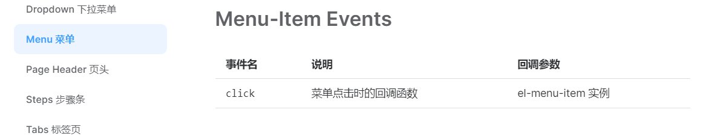

```
<el-menu-item :index="item.path" v-if="!item.meta.hidden" @click="goRoute">

import { useRouter } from 'vue-router';
let $router = useRouter()

//点击菜单回调
const goRoute = (vc:any)=>{
  $router.push(vc.idex);
}
```

##### Main.vue

- 跳完之后需要有一个显示的地方

```
   <div class="layout_menu">
      <el-menu background-color="#00000" text-color="rgb(81,90,110)"> 
        <!-- 根据路由动态生成 -->
        <Menu :menuList="userStore.menuRoutes"></Menu>
      </el-menu>
    </div>
    <!-- 右侧主内容 -->
    <div class="layout_main">
      <Main></Main>
    </div>

import Main from './main/index.vue'
```

- Main.vue

router-view显示页面的，当切换页面的时候，当前组件销毁、目标组件新建。这里是添加了一个渲染动画fade，可以让你自定义。

```html
<template>
  <div>
    <router-view v-slot="{Component}">
      <transition name="fade">
        <!-- 渲染layout一级路由组件的子路由 -->
        <component :is="Component"></component>
      </transition>
    </router-view>
  </div>
</template>

<script setup lang="ts">

</script>

<style scoped>
.fade-enter-from {
  opacity: 0;
}

.fade-enter-active {
  transition: all 1s;
}

.fade-enter-to {
  opacity: 1;
}
</style>
```


#### 菜单折叠

el-menu加一个collapse，菜单就会折叠

```html
<el-menu background-color="#00000" text-color="rgb(81,90,110)" collapse> 
	<Menu :menuList="userStore.menuRoutes"></Menu>
</el-menu>
```

**看面包屑组件那块具体实现**

#### 菜单展开

```
<el-menu :default-active="$route.path"> 

import { useRoute } from 'vue-router';
let $route = useRoute()
```

default-active设置为 el-menu中唯一的index时，刷新页面也会默认展开菜单。因为之前我们书写菜单的时候，每个item的index绑定的是路由，所以这里用路由

### ③Tabbar

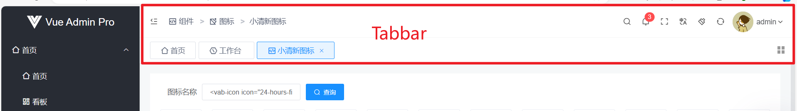

静态搭建

```html
<template>
  <div class="tabbar-top">
    <Breadcrumb></Breadcrumb>
    <Setting></Setting>
  </div>
  <div class="tabbar-bottom">
    <Tab></Tab>
  </div>
</template>

<script setup lang="ts">
import Breadcrumb from './breadcrumb/index.vue'
import Setting from './setting/index.vue'
import Tab from './tab/index.vue'
</script>
```

#### 面包屑

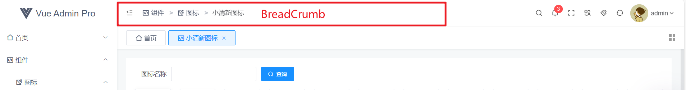

##### 静态搭建

```html
<template>
  <div class="breadcrumb">
    <el-icon style="margin-right: 12px;"><Expand /></el-icon>
    <el-breadcrumb :separator-icon="ArrowRight">
      <el-breadcrumb-item>权限管理</el-breadcrumb-item>
      <el-breadcrumb-item>菜单管理</el-breadcrumb-item>
    </el-breadcrumb>
  </div>
</template>

<script setup lang="ts">
import { ArrowRight } from '@element-plus/icons-vue'
</script>
```

##### 菜单折叠

点击最左边的箭头的时候，menu收起，箭头图标切换！

面包屑中点击折叠之后，整个框架中的组件宽度会发生变化。**孙子给爷爷组件传参，想到了pinia**

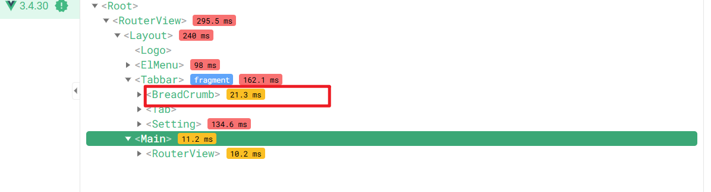

- src\store\modules\setting.ts

```javascript
//小仓库:layout组件相关配置仓库
import { defineStore } from 'pinia'

const useLayOutSettingStore = defineStore('SettingStore', {
  state: () => {
    return {
      fold: false, //用户控制菜单折叠还是收起控制
      refsh: false, //仓库这个属性用于控制刷新效果
    }
  },
})

export default useLayOutSettingStore
```

 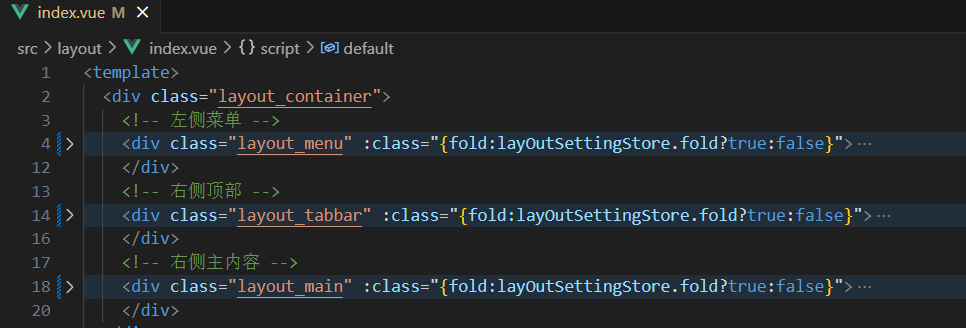

##### 动态展示路由

```html
<el-breadcrumb :separator-icon="ArrowRight">
  <el-breadcrumb-item v-for="(item,index) in $route.matched" :key="index" :to="item.path" v-show="item.meta.title">
    <span>{{ item.meta.title }}</span>
  </el-breadcrumb-item>
</el-breadcrumb>

import { useRoute } from 'vue-router';
const $route = useRoute()
```

breadcrumb中的to属性可以用来跳转

```
<el-breadcrumb-item :to="item.path">
```

#### 刷新

> 点击Setting中的刷新按钮，Main内容更新（组件销毁+挂载）

涉及到【叔侄通信】：使用pinia。

侄子组件中通过点击button修改 仓库中的refsh

叔叔组件 Main中监听仓库数据是否变化，如果变化，说明点击过刷新的按钮


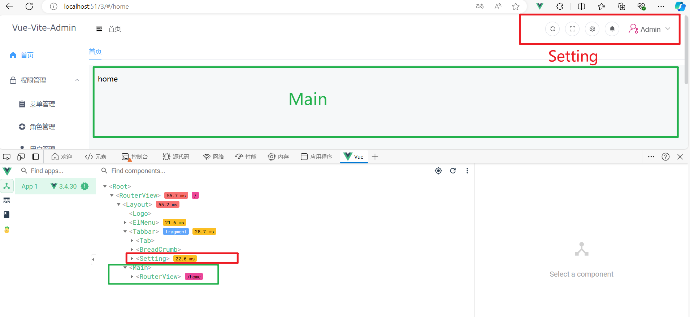

- src\store\modules\setting.ts

```javascript
//小仓库:layout组件相关配置仓库
import { defineStore } from 'pinia'

const useLayOutSettingStore = defineStore('SettingStore', {
  state: () => {
    return {
      fold: false, //用户控制菜单折叠还是收起控制
      refsh: false, //仓库这个属性用于控制刷新效果
    }
  },
})

export default useLayOutSettingStore
```

- src\layout\tabbar\setting\index.vue

```html
<el-button size="default" icon="Refresh" circle bg="true" @click="updateRefsh"></el-button>

import useLayOutSettingStore from '@/store/modules/setting';
let layOutSettingStore = useLayOutSettingStore()
const updateRefsh = () => {
  layOutSettingStore.refsh = !layOutSettingStore.refsh
}
```

- src\layout\main\index.vue

> watch监听
>
> 销毁组件可以通过 v-if 
>
> nextTick ：nextTick所指定的回调会在浏览器更新DOM完毕之后再执行。

局部刷新。

 ```html
 <template>
   <div>
     <router-view v-slot="{Component}">
       <transition name="fade">
         <!-- 渲染layout一级路由组件的子路由 -->
         <component :is="Component" v-if="flag"></component>
       </transition>
     </router-view>
   </div>
 </template>
 
 <script lang="ts">
 export default {
   name: 'Main'
 }
 </script>
 
 <script setup lang="ts">
 import {watch,ref,nextTick} from 'vue'
 import useLayOutSettingStore from '@/store/modules/setting';
 let layOutSettingStore = useLayOutSettingStore()
 
 //控制当前组件是否销毁重建
 let flag = ref(true)
 watch(() => layOutSettingStore.refsh, ()=>{
   //点击刷新按钮，路由组件销毁
   flag.value = false
   nextTick(()=>{
     flag.value = true
   })
 })
 </script>
 ```

#### 全屏模式

> ① document.fullscreenElement 
>
> 这个DOM对象属性可以用来判断当前是不是全屏，全屏返回真，非全屏返回假
>
> ②  document.documentElement.requestFullscreen();
>
> 文档根节点的方法requestFullscreen实现全屏模式
>
> ③ 退出全屏模式
>
> document.exitFullscreen()

- src\layout\tabbar\setting\index.vue

```
<el-button size="default" icon="FullScreen" circle  @click="fullScreen"></el-button>

// 全屏
const fullScreen = () => {
  let full = document.fullscreenElement 
  if(!full) {
    document.documentElement.requestFullscreen();
  } else {
    document.exitFullscreen()
  }
}
```

#### token【重要】

> onMounted
>
> token在所有地方都需要=>放在仓库里

##### 登陆成功

登录成功，跳转指定的页面（$router.push）。一般是根路由，最开始进入这个界面的时候，也就是页面挂载完毕，就要发送请求获取用户信息，过程中使用到token（相当于淘宝登录完成后进入淘宝首页，首页是根据你的信息进行渲染的）。要根据路由数组分析，进入到本页面的时候，是哪个组件先进

① 输入用户名和密码，登录成功，服务器返回一个token，用的插件 JWT json web token 会返回一个token（每一个用户的唯一标识）。因为token很多地方要用，就存储在仓库中。②其他所有页面都需要带上token，所以可以放在请求拦截器中。

- 根路由挂载后要做的事情，就是带着token去发送请求，加载主页数据。

  下面的代码是写在了文件src\views\home\index.vue中，但是下文【路由鉴权】后就不需要这一段了

```javascript
import { onMounted } from 'vue';
import useUserStore from '@/store/modules/user';
let userStore = useUserStore()
//首页挂在完毕发请求
onMounted(()=>{
  userStore.userInfo()
})
```

这里调用 userStore仓库 的userInfo() 方法

- src\store\modules\user.ts

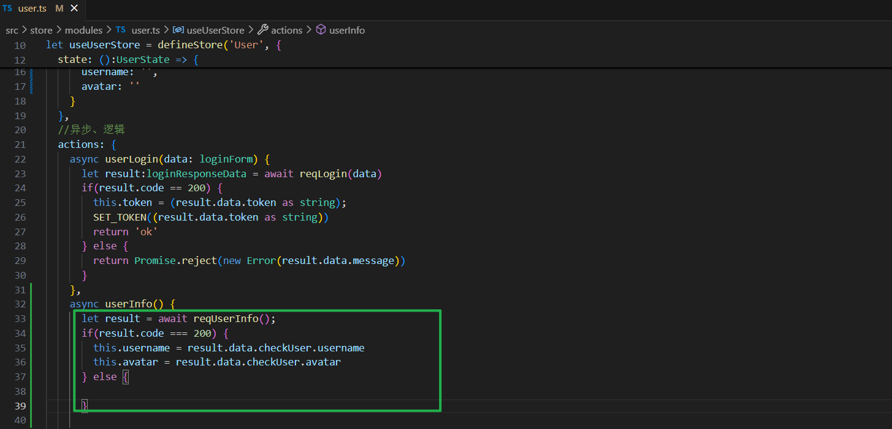

##### 退出登录

退出登录：

① 向服务器发请求（退出登录接口）告诉服务器，这个token无效了！当我下一次登陆的时候，你要重新给我一个新的token。mock假数据中只提供了登录接口&请求用户数据接口

② 仓库中删除用户信息（token username avatar）、浏览器缓存中也要清除token

③ 跳转到登陆界面


- 对于② 在用户仓库中提供一个userLogout方法，然后我们在Setting（退出登录在的组件）中调用这个方法即可

  在 src\utils\token.ts 我们把和token相关的方法都封装在工具库中utils下了，所以直接调用REMOVE_TOKEN 方法

```javascript
//用户仓库

let useUserStore = defineStore('User', {
  //存储数据
  state: ():UserState => {
    return {
      token: GET_TOKEN(), //用户唯一标识token
      menuRoutes: constantRoute, //菜单生成路由
      username: '',
      avatar: ''
    }
  },
  //异步、逻辑
  actions: {
    //用户登录
    async userLogin(data: loginForm) {
     ...
    },
    //获取用户信息方法
    async userInfo() {
     ...
    },
    //退出登录
    async userLogout() {
      //目前没有mock接口：退出登录接口（通知服务器 本地用户唯一标识失效）
      this.token = ''
      this.username = ''
      this.avatar = ''
      REMOVE_TOKEN() //清空浏览器缓存
    }
  }
})
```

- 对于③，借助路由器进行跳转，注意这里要在vue文件中，在TS文件中是不生效的

```
src\layout\tabbar\setting\index.vue

//退出登录
const logOut = ()=> {
  userStore.userLogout();
  $router.push({path: '/login'})
}
```

##### 问题解决

###### 记住路由

<font color="Red">**此时存在的问题：①登录退出后，重新登录成功后，希望浏览器记住路由 ** </font>

- ① 退出时，$router.push()时，携带一个query参数，

```javascript
import { useRouter, useRoute } from 'vue-router'
let $router = useRouter()
let $route = useRoute()

//退出登录
const logOut = ()=> {
  userStore.userLogout();
  $router.push({path: '/login',query:{redirect:$route.path}})
}
```

在Login组件中，登录成功跳转：

```javascript
let redirect: any = $route.query.redirect;
$router.push({ path: redirect || '/' });
```

###### 进度条功能

- <font color="Red">**② 任意路由切换的进度条功能 ** </font>

  全局守卫：项目中任意路由切换都会触发的钩子

​        解决方法：全局路由守卫+nprogress（插件 pnpm i nprogress）

- 新建文件 src\permission.ts

```javascript
// @ts-ignore
import nprogress from 'nprogress' 
//注意@ts-ignore是为了不让上面这句话检查报错

//全局守卫：项目当中任意路由切换都会触发的钩子
//全局前置守卫
router.beforeEach((to:any, from:any, next:any) => {
  nprogress.start()
  next()
}) 
//全局后置守卫
router.beforeEach((to:any, from:any) => {
  nprogress.done()

}) 如果相对
```

- main.ts

```javascript
//引入路由鉴权文件
import './permission'
```

如果想对进度条的样式进行修改，可以直接在文件 node_modules\nprogress\nprogress.css 里 `#nprogress .bar` 修改

###### 路由鉴权

- <font color="Red">**③ 路由鉴权，使用全局路由守卫 ** </font>

> 全部路由组件：登录|404|其他路由|首页（一级）|数据大屏|权限管理（三个子路由）
>
> （1）用户未登录：只能访问login
>
> （2）用户登录成功：不可以访问login，其余路由可以
>
> **怎么判断用户有没有登录？使用token。用户没有登陆就没有token，只有登陆成功才能有token。**

要在permission.ts中获取用户相关的小仓库内部token，如果是TS文件，要先引入大仓库 src\permission.ts

- src\permission.ts

```javascript
import router from '@/router'
//进度条包
// @ts-ignore
import nprogress from 'nprogress'
import 'nprogress/nprogress.css' //进度条样式

//引入setting文件（项目统一名称）
import setting from './setting'

//获取用户相关的小仓库内部的token数据，判断用户是否登陆成功
//不在组件（.vue文件）中引入的话，需要把pinia引入
//获取小仓库的前提是大仓库存在
import pinia from './store'
import useUserStore from './store/modules/user'
let userStore = useUserStore(pinia)

//进度条不要加载的小圆圈
nprogress.configure({showSpinner: false}) 

//全局守卫：项目当中任意路由切换都会触发的钩子
//全局前置守卫
router.beforeEach(async(to:any, from:any, next:any) => {
  console.log('src\permission.ts - from未使用',from);
  document.title = `${setting.title} - ${to.meta.title}` //网页名称

  nprogress.start() //进度条
  //路由鉴权-通过token
  let token = userStore.token
  if(token) { //用户登陆了，有token
    if(to.path == '/login') {
      next({path:'/'})
    } else {
      try {
        //登录成功后可以访问除了login之外的所有路由
        //保证token不过期
        //如果没有用户信息，在守卫这里发送请求获取用户信息
        await userStore.userInfo()
        next()
      } catch(error) {
        //token过期，无法获取用户信息
        //用户手动修改了token
        //相当于退出登录！
        userStore.userLogout() //清空数据
        next({path: '/login',query:{redirect: to.path}})//回到login
      }
    }
  } else { //用户没有登录，无token
    if(to.path == '/login') {
      next()
    } else {
      next({path: '/login',query:{redirect: to.path}})
      //query我把你想去但因为没有token没有去成的路径保留
    }
  }
  
}) 
//全局后置守卫
router.beforeEach((to:any, from:any) => {
  console.log('src\permission.ts - from未使用',to,from);

  nprogress.done() //进度条

}) 
```


### 路由鉴权 路由守卫 

> 全局守卫：项目中任意路由切换都会触发的钩子
>
> 组件外使用仓库

① 任意路由切换实现进度条效果 

解决方法：全局路由守卫+nprogress（插件 pnpm i nprogress）

② 路由组件访问权限的设置（没有登陆的时候 一些路由不可以访问，用户登录不能访问login）

③【每次切换路由的时候用户信息保证不变】 场景是 刚登陆完，用户拿到后台给的token，但此时没有用户信息（还包括订单权限什么的），就统一在路由首位中获取一下用户的信息。


**组件外使用仓库**

```typescript
//在组件的外部想直接引入小仓库是不可以的，必须先引入大仓库
import useUserStore from './store/modules/user'
import pinia from './store'
let userStore = useUserStore(pinia)
console.log(userStore);
```


# 真实接口替换mock

① 【.env.development】环境变量中设置 开发环境使用的 后端URL 

```
VITE_APP_BASE_API = '/api'
VITE_SERVE = 'http://sph-api.atguigu.cn'
```

② 【vite.config.ts】解决跨域问题：vite中的 代理服务器

```typescript
import { defineConfig, loadEnv } from 'vite'
export default defineConfig(({command, mode})  => {
 // 获取各种环境下对应的变量
 let env = loadEnv(mode, process.cwd() )
```

 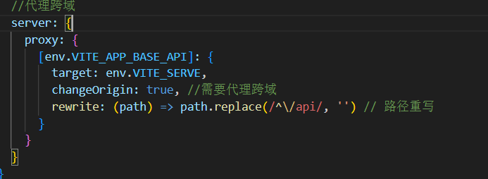

③ 【/api/user/index.ts】API中替换之前的URL

④ 【/store/modules/user.ts】因为登录页面发送请求（调用API） 是在仓库中实现的

vite获取根目录的方法 process.cwd() ，index.html所在的位置


## 接口文档

服务器域名:http://sph-api.atguigu.cn
swagger文档:
http://139.198.104.58:8209/swagger-ui.html
http://139.198.104.58:8212/swagger-ui.html#/

echarts:国内镜像网站
https://www.isqqw.com/echarts-doc/zh/option.html#title
http://datav.aliyun.com/portal/school/atlas/area_selector

## ts限制

登录接口，发送请求的时候，携带用户名&密码参数

```typescript
export const reqLogin = (data:loginFormData) => {
  return request.post<any,loginResponseData>(API.LOGIN_URL, data)
  //loginResponseData限制返回类型
}
```

第一个any表示相应的数据类型，第二个参数表示响应数据的结构类型


# 问题

SCSS的reset可能没有弄好，导致网页有一个圆弧边框

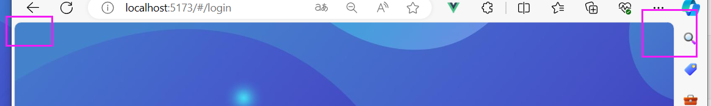


# 【品牌管理】

静态搭建 => 分页、刷新时获取动态数据 （这一步要配置API）=> 新增品牌、修改品牌（对话框、这一步图片那部分比较难、表单校验）

## 静态搭建

el-card

el-table

el-pagination

## api

http://139.198.104.58:8209/swagger-ui.html#!/base45trademark45controller/indexUsingGET

>V:\Web\Github_commit\GuiGuZhenXuan\vue3_admin_template\project\src\api\product\trademark\index.ts


## 上传图片不懂

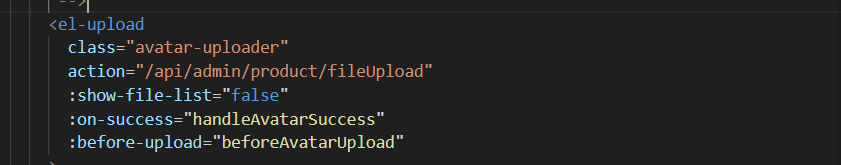

## form验证

form解构数据

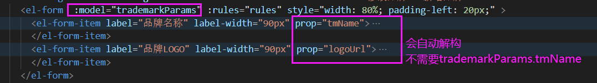

form表单校验 图片的时机 利用

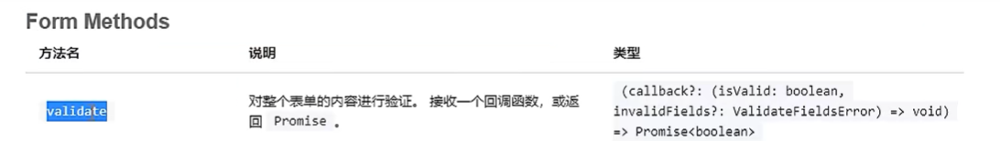

获取form表单实例，validate函数返回的是一个promise对象

配套有一个函数 clearValidate('logoUrl') 清除验证规则

```
  formRef.value?.clearValidate('tmName')
  有el-form之后才清除，没有就不清楚
```

也可以使用nextTick

# axios<any,any>

https://juejin.cn/post/7169850876494888996


elementUI 用户头像上传


新增品牌和更新品牌，一个不带ID（后端分配），一个带ID（需要用ID唯一识别）


# 【属性管理】

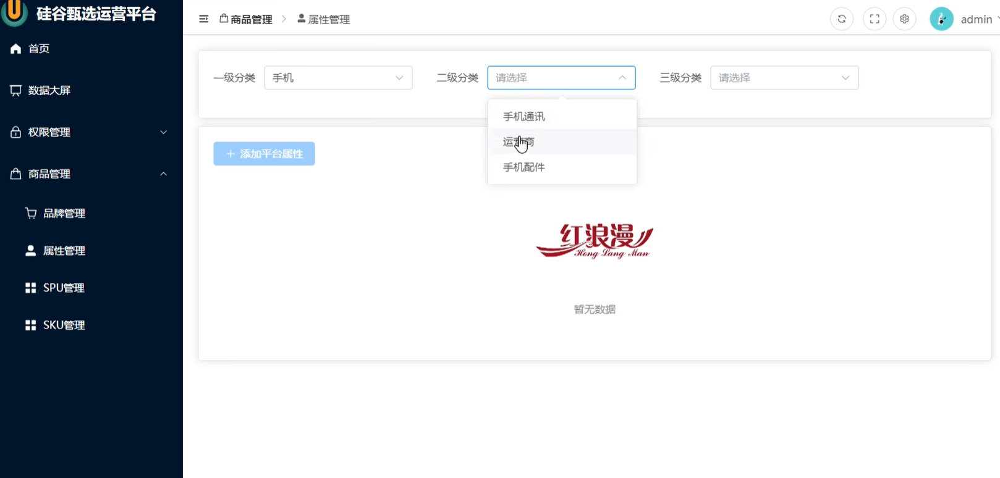

onMounted：发一次请求，获取一级分类。在一级分类被确定的时候，请求二级分类。在二级分类被确定后，请求三级分类。

## 静态搭建

> ① 行内表单：el-form里面的元素独占一行，但一级、二级、三级分类是在同一行。所以要设置表单的inline属性为true
>
> ② el-card、el-form（el-option）、el-select、el-table
>
> ③ 全局组件

```vue
<template>
  <div class="attr_box">
    <el-card>
      <el-form :inline="true">
        <el-form-item label="一级分类">
          <el-select>
            <el-option label="北京"></el-option>
            <el-option label="上海"></el-option>
            <el-option label="广州"></el-option>
            <el-option label="深圳"></el-option>
          </el-select>
        </el-form-item>
        <el-form-item label="二级分类">
          <el-select>
            <el-option label="北京"></el-option>
            <el-option label="上海"></el-option>
            <el-option label="广州"></el-option>
            <el-option label="深圳"></el-option>
          </el-select>
        </el-form-item>
        <el-form-item label="三级分类">
          <el-select>
            <el-option label="北京"></el-option>
            <el-option label="上海"></el-option>
            <el-option label="广州"></el-option>
            <el-option label="深圳"></el-option>
          </el-select>
        </el-form-item>
      </el-form>
    </el-card>
    <el-card style="margin-top: 20px;">
      <el-button type="primary" size="default" icon="Plus" style="margin-bottom: 10px;">添加属性</el-button>
      <el-table border style="margin: 10px 0px;">
        <el-table-column label="序号" type="index" align="center" width="80px"></el-table-column>
        <el-table-column label="属性名称" width="120px"></el-table-column>
        <el-table-column label="属性值名称"></el-table-column>
        <el-table-column label="操作" width="120px"></el-table-column>
      </el-table>
    </el-card>
  </div>
</template>
```

 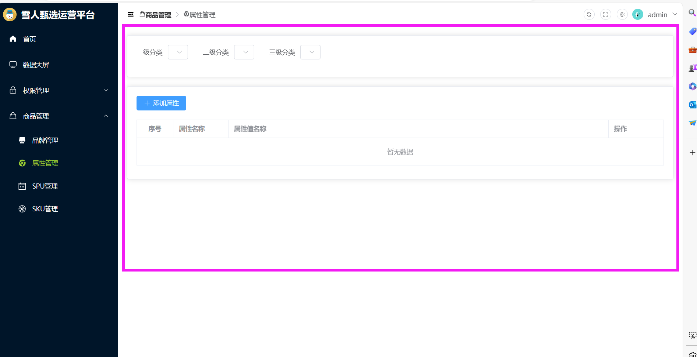


因为下拉部分别的页面也需要，所以注册为全局组件


## API接口定义

```typescript
//属性相关API文件
import request from "@/utils/request";

enum API {
  //一级分类接口地址
  C1_URL = '/admin/product/getCategory1',
  //二级
  C2_URL = '/admin/product/getCategory2/',
  C3_URL = '/admin/product/getCategory3/'
}

export const reqC1 = () => {
  return request.get<any, any>(API.C1_URL)
}


export const reqC2 = (category1ID: number) => {
  return request.get<any, any>(API.C2_URL + category1ID)
}


export const reqC3 = (category2ID: number) => {
  return request.get<any, any>(API.C3_URL + category2ID)
}
```


## 页面中调用API

### el-select使用

- option
  - label是下拉菜单显示的数据
  - value是下拉菜单收集的数据，真正要绑定要依靠value属性

```vue
<el-select  v-model=" c1Id" style="width: 200px">
  <el-option  v-for="(item, index) in c1Arr" 
              :key="item.id" 
              :label="item.name"
              :value="item.id"></el-option>
</el-select>

//收集菜单的数据
let c1Id = <number | string>('')
```

### 仓库的使用

因为我们把下拉菜单注册为全局组件，所以他在【属性管理】页面中属于子组件。

当子组件中确定了，一级分类、二级分类、三级分类时，父组件中需要呈现对应的数据。**涉及到组件通讯，为了方便起见，使用仓库更加合适。**


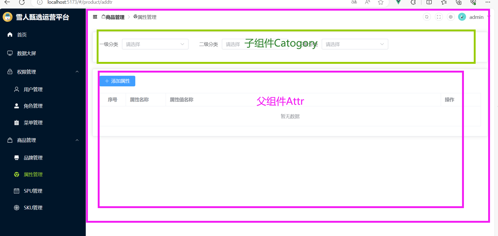

### TS类型限制

① /api/ 服务器请求时，发送数据&接收数据时 的数据类型

② 仓库中的类型

## 二级分类请求发送时间

> 根据上文，一级分类的请求已经编写完毕。开始考虑二级分类

① 全局组件Category中，**监听store**中 C1ID（一级分类的选择）的变化，如果变化了就去请求二级菜单。

② el-select中有一个 change事件，当选中值的时候触发，保证一级分类ID存在

```    <el-select @change="回调函数">```

## 卡片内容的切换

```typescript
let scene = ref<number>(0)
```

card组件内容切换变量

scene=0. 显示table数据；scene=1，展示添加与修改属性结构

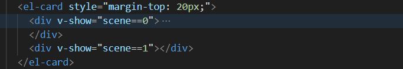

# 记录

P74

- 属性管理-修改属性  深拷贝 浅拷贝  

``` typescript
// 浅拷贝
Object.assign(attrParams, row)

// 深拷贝
Object.assign(attrParams, JSON.parse(JSON.stringify(row)))
```

清空仓库 数据  4reset方法

# 【SPU】

SPU: 电商术语，代表一个标准化产品单元

SPU组成：产品品牌名字、描述、公司旗下产品图片介绍、销售属性


SKU：库存量最小单元


P79

v-show 性能

自定义事件 子组件给父组件传参

P80 

修改SPU

P81 

点击修改SPU，跳转页面。父组件=>子组件，但此时父组件的数据不完整。需要发四个请求才能组成一个完整的SPU。

这四个请求的发送时机：不可以在子组件的onMounted中发送，因为我们使用的是v-show显示，已经存在了。在子组件中定义函数，然后在父组件中获取子组件的实例，

P84

照片墙

P87

数组查看是否重复 find方法

P88

照片墙数组数据处理，map方法

P89 

spuForm.vue

子组件中 对外暴露initAddSpu

# 用户管理

# 数据大屏

适配问题

（1）VW VH 兼容IE8以上

echarts文字不支持vw vh只能px

（2）CSS中的scale

# 权限管理

所有路由：

login、404、any、首页(/home)、数据大屏


**【开发菜单权限】**

不同身份能访问的路由是不一样的。

- 第一步 拆分路由

**静态路由（常量路由）**：所有人都可以拥有的路由

login、首页、404、数据大屏

**异步路由**：不同的身份有的有这个路由、有的没有

权限管理（三个子路由）、商品管理（四个子路由）

**任意路由**：任意路由

- 菜单权限开发思路

目前我们的i项目：任意用户的权限是一样的，是因为注册路由时一样。

要先拆路  V:\Web\Github_commit\GuiGuZhenXuan\vue3_admin_template\project\src\router\routes.ts

# 总结

elementUI ：熟练使用 能封装。分页、eltable、elform、drawer、elmessage、eltree

递归：路由、树型控件（项目布局 ）

添加和更新业务放在一起

分配权限 路由权限、自定义指令

echart。数据大屏 适配问题scale解决

