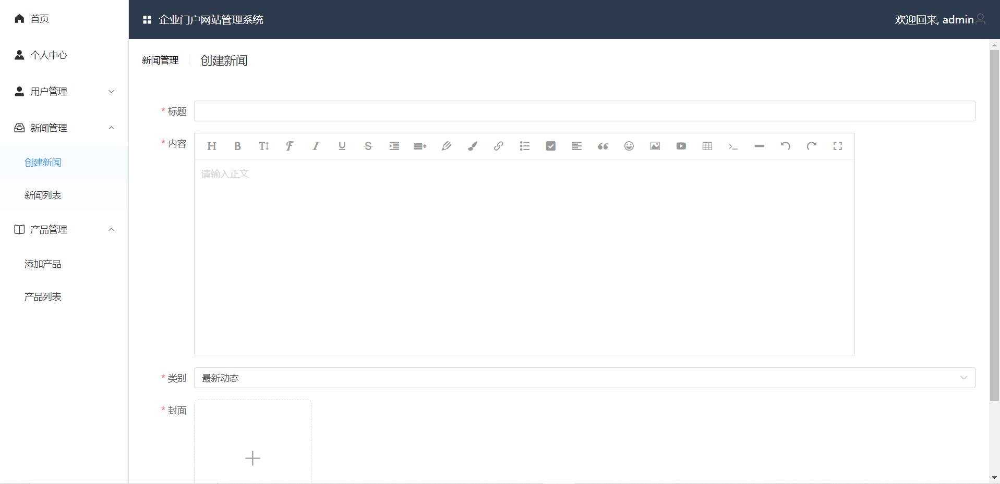
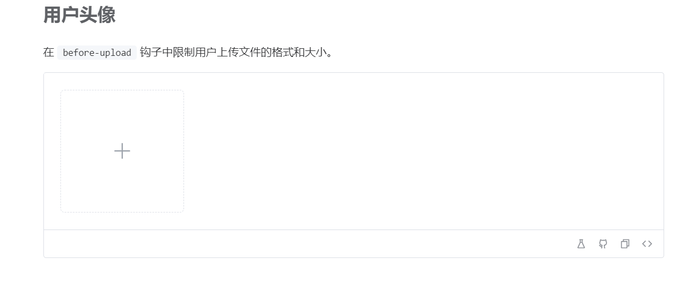

# 新闻管理




## wangeditor

```
pnpm i wangeditor --save
```

- 封装成组件

```vue
<template>
    <div id="myeditor">

    </div>
</template>
<script setup>
import { onMounted,defineEmits,defineProps } from "vue";
import E from "wangeditor";
const emit = defineEmits(["event"])

const props = defineProps({
  content:String
})
onMounted(() => {
  const editor = new E("#myeditor");
  editor.create();
  //设置初始值
  props.content &&  editor.txt.html(props.content)

  editor.config.onchange = function(newHtml) {
    // console.log("change 之后最新的 html", newHtml);
    //子传父
    emit("event",newHtml)
  };
});
</script>

```

## 封装upload

elementplus的uploadhttps://element-plus.org/zh-CN/component/upload.html



```html
  <el-upload
      class="avatar-uploader"
      action="https://jsonplaceholder.typicode.com/posts/"
      :show-file-list="false" 上传之后 是否展示上传列表
      :auto-upload="false"  不能自动提交 要等别的数据一起
      :on-change="handleChange"  API中：文件状态改变时的钩子
  >
      
      <el-icon
          v-else
          class="avatar-uploader-icon"
      >
          <Plus />
      </el-icon>
  </el-upload>

```

- 样式

使用时style样式记得复制，**要深度选择  `::v-deep`**

- 动作

选中图片之后要显示在页面上 `:on-change="handleChange"` 搭配

```javascript
const handleChange = (file) => {
  //选完图片之后的回调 
  userForm.avatar = URL.createObjectURL(file.raw)
};
```

