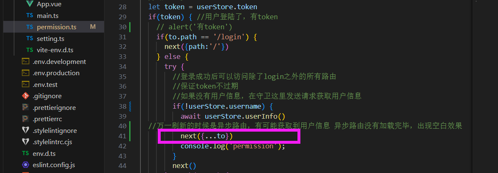

【用户管理】

[onMounted]  获取所有用户：用户名 创建时间 密码 id  roleName  "中级架构师,1999111"

[分配角色] 返回所有角色+该用户有的角色

用户管理
分配角色

按钮：文员能看不能改
首页：公司企业文化：甜品
多加一个页面，写这个模块的设计思路。

【角色管理】技术 厨子 文员 管理员
——静态搭建（角色表:  id:number,职位名:string,remark:string）
获取角色  get  /admin/acl/role/{page}/{limit}
新增角色          post /admin/acl/role/save（添加和更新接口放在一起）
删除角色       delete /admin/acl/role/remove/{id}
获取/查找角色          get  /admin/acl/role/get/{id}
更新角色          put  /admin/acl/role/update
——分配角色权限：树形控件
根据角色获取菜单  get /admin/acl/permission/toAssigin/{角色id}
(表格:  角色id, 菜单name, 在树的哪一个结构level, children, )
level共4个，123是路由，4是按钮

修改某角色的菜单权限 post /admin/acl/permission/doAssign (角色id, 要下发权限的菜单id )

【菜单管理】
常量路由+动态路由  
获取菜单 get /admin/acl/permission 
添加/编辑  post /admin/acl/permission/save (level name code pid )
删除 delete /admin/acl/permission/remove/{id}


# menu菜单权限

**拆分路由：常量路由&动态路由&任意路由**

- 所有路由

login(登录页面)、404(404一级路由)、任意路由、
首页(/home)、数据大屏、
权限管理(三个子路由)
商品管理模块(四个子路由)

- 常量路由 大家都能访问的

login、首页、404

- 动态路由

权限管理、新闻管理、商品管理、组件管理

- 任意路由

根据用户的角色，分配不同的权限，后端返回

```javascript
用户登录成功后应该返回的数据：异步路由、异步按钮权限、角色、姓名、头像
routes: ['Acl','PersonalCenter','User','Permission','Role','News','NewsAdd','NewsEdit','Vcomponent','Vform','Vicon','Vlist','Vtable'] //对应路由name
buttons: ['btn.Attr.add']

根据角色分配的路由 routes: ['Prodect', 'news', '' ]
根据角色分配的按钮权限 buttons: ['Prodect', 'news', '' ]
```


**在user.ts中过滤**

```javascript
import { constantRoute, asyncRoute, anyRoute } from '@/router/routes';

//过滤当前用户的异步路由
function filerAsyncRoute(asyncRoute:any, routes:any) {
  return asyncRoute.filter((item:any)=>{
    if(routes.includes(item.name)) {
      if(item.children&&item.children.length>0) {
        item.children = filerAsyncRoute(item.children, routes)
      }
      return true
    }
  })
}
```

问题1：从普通用户(权限少)切回管理员(权限多)之后，一些路由不见了。filerAsyncRoute函数是浅拷贝 会修改原数组asyncRoute的值，要引入深拷贝


**asyncRoute要进行深拷贝**`pnpm i lodash`

```javascript
//@ts-ignore
import cloneDeep from 'lodash/cloneDeep'

let userAsyncRoute =  filerAsyncRoute(cloneDeep(asyncRoute), result.data.routes)
```


问题2：异步路由对应的路由组件没加载完就要访问这个 路径了

在守卫中解决 permission.ts

