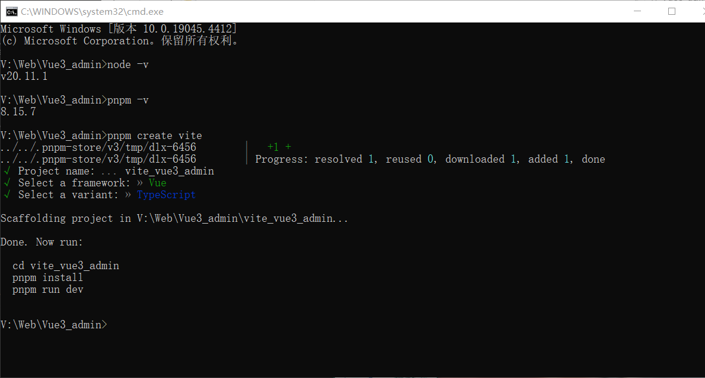
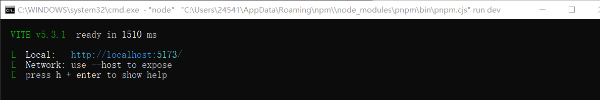
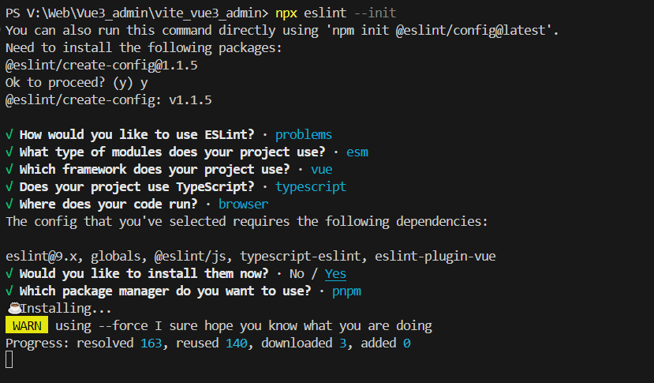
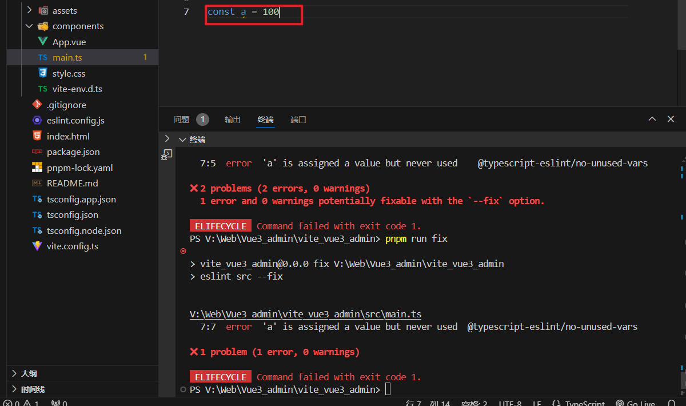
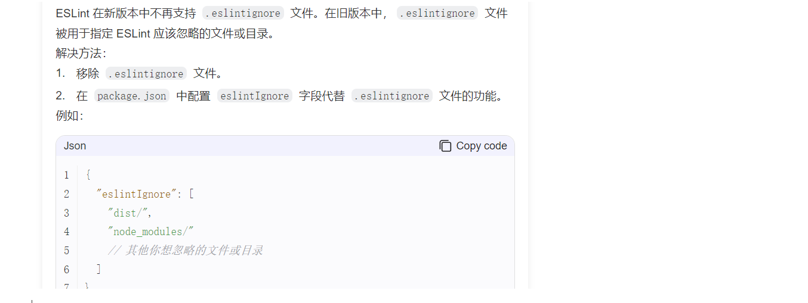
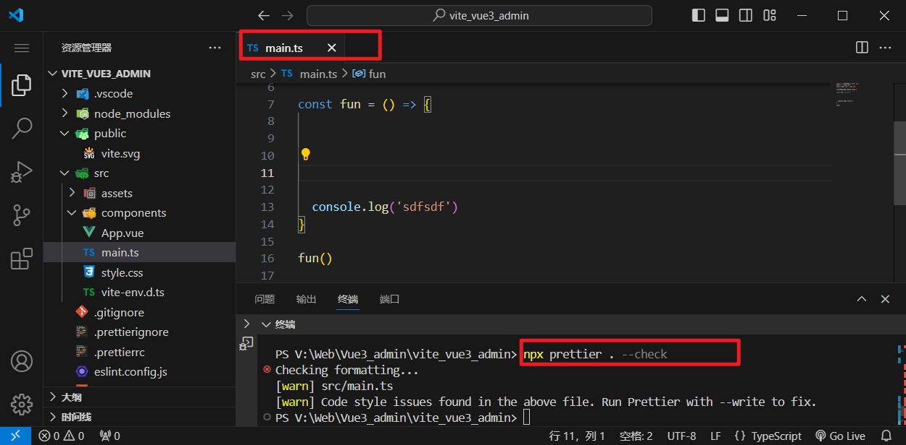
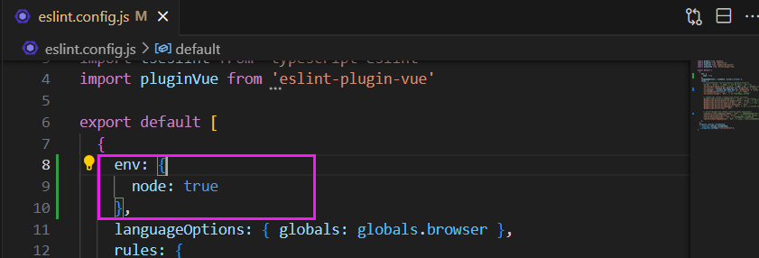
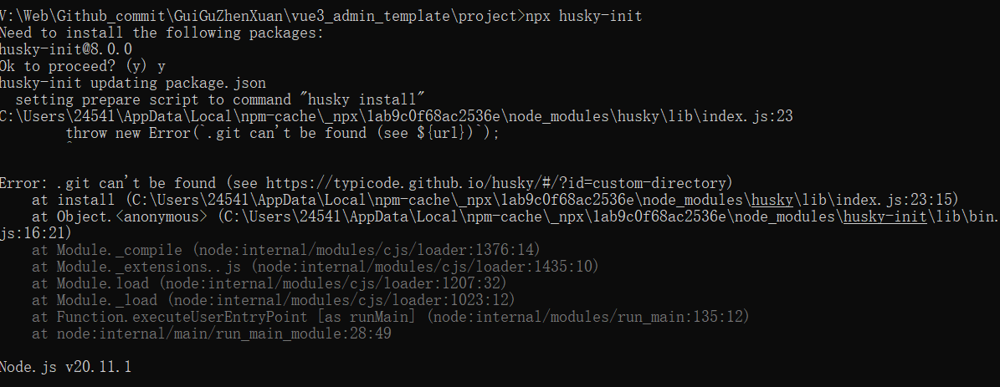
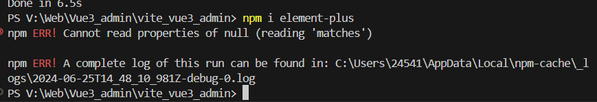

pnpm vite

# 项目搭建 

- vite创建

```
node -v
pnpm -v

pnpm create vite //使用 PNPM，我用的是pnpm
npm init vite@latest //使用 NPM
pnpm create vite //使用 Yarn
```



- 安装依赖+运行项目

```
 cd vite_vue3_admin
 pnpm install
 pnpm run dev
```



## 项目目录结构

在开发期间 Vite 是一个服务器，而 `index.html` 是该 Vite 项目的入口文件。

```
│  ├─node_modules # 项目依赖
│  │
│  ├─public # 静态资源目录
│  │      vite.svg 
│  │
│  ├─src
│  │  │  App.vue # 入口vue文件
│  │  │  main.ts # 入口文件
│  │  │  style.css
│  │  │  vite-env.d.ts # vite环境变量声明文件
│  │  │
│  │  ├─assets # 资源文件目录
│  │  │      vue.svg
│  │  │
│  │  └─components # 组件文件目录
│  │         HelloWorld.vue
│  │
│  │ .gitignore
│  │ index.html # Vite项目的入口文件
│  │ package.json # 项目或者模块包的描述
│  │              # npm install 命令会根据这个文件下载所有依赖模块。
│  │ pnpm-lock.yaml # 锁定项目所依赖的包的版本
│  │ README.md
│  │ tsconfig.json # tsconfig配置文件
│  │ tsconfig.app.json 
│  │ tsconfig.node.json 
│  │ vite.config.ts # vite配置文件

```

# 项目配置

## 自动打开项目

package.json

```
"scripts": {
    "dev": "vite --open",
    "build": "vue-tsc -b && vite build",
    "preview": "vite preview"
  },
```

## eslint

- 【步骤一】首先安装eslint

```powershell
pnpm i eslint -D
```

- 【步骤二】生成配置文件:.eslint.cjs

```
npx eslint --init # 命令初始化eslint
```



- 【步骤三】生成eslint.config.js 而不是 eslintrc.cjs

> 官网https://www.tkcnn.com/eslint/configuring/configuration-files-new.html#%E9%85%8D%E7%BD%AE%E5%AF%B9%E8%B1%A1

```javascript
// eslint.config.js 
import globals from "globals";
import pluginJs from "@eslint/js";
import tseslint from "typescript-eslint";
import pluginVue from "eslint-plugin-vue";


export default [
  {files: ["**/*.{js,mjs,cjs,ts,vue}"]},
  {languageOptions: { globals: globals.browser }},
  pluginJs.configs.recommended,
  ...tseslint.configs.recommended,
  ...pluginVue.configs["flat/essential"],
];
```

- **硅谷甄选项目中生成 eslintrc.cjs，也来学习一下：**

```javascript
module.exports = {
   //运行环境
    "env": { 
        "browser": true,//浏览器端工作
        "es2021": true,//es2021 校验ES语法
    },
    //规则继承
    "extends": [ 
       //全部规则默认是关闭的,这个配置项开启推荐规则,推荐规则参照文档
       //比如:函数不能重名、对象不能出现重复key
         
        "eslint:recommended", // 开启eslint推荐规则
        //vue3语法规则 检测vue
        "plugin:vue/vue3-essential",
        //ts语法规则 检测ts
        "plugin:@typescript-eslint/recommended"
    ],
    //要为特定类型的文件指定处理器
    //比如校验markdown，要自己添加
    "overrides": [
    ],
    
    //指定解析器:解析器
    //Esprima 默认解析器
    //Babel-ESLint babel解析器
    //@typescript-eslint/parser ts解析器
    "parser": "@typescript-eslint/parser",
    
    //指定解析器选项
    "parserOptions": {
        "ecmaVersion": "latest",//校验ECMA最新版本
        "sourceType": "module"//设置为"script"（默认），或者"module"代码在ECMAScript模块中
    },
    //ESLint支持使用第三方插件。在使用插件之前，您必须使用npm安装它
    //该eslint-plugin-前缀可以从插件名称被省略
    "plugins": [
        "vue", //检测vue语法的插件
        "@typescript-eslint" // 检测TS语法的插件
    ],
    //eslint规则
    "rules": {
    }
}
```

### ①vue3环境代码校验插件

安装指令

```
pnpm install -D eslint-plugin-import eslint-plugin-vue eslint-plugin-node eslint-plugin-prettier eslint-config-prettier eslint-plugin-node @babel/eslint-parser
```

### ②修改.eslintrc.cjs配置文件

我的 eslint.config.js 没有修改，按照原样不懂是可以直接检测的。



### ③.eslintignore忽略文件

.eslintignore忽略文件（被废除）



### ④运行脚本

package.json新增两个运行脚本

```
"scripts": {
    "lint": "eslint src", // 执行lint的时候，检测src中的代码
    "fix": "eslint src --fix", //自动修补
}
```

## prettier

>  官网：https://prettier.nodejs.cn/docs/en/plugins.htm

有了eslint，为什么还要有prettier？eslint针对的是javascript，他是一个检测工具，包含js语法以及少部分格式问题，在eslint看来，语法对了就能保证代码正常运行，格式问题属于其次；

而prettier属于格式化工具，它看不惯格式不统一，所以它就把eslint没干好的事接着干，另外，prettier支持包含js在内的多种语言。

总结 **eslint和prettier 一个保证js代码质量，一个保证代码美观。**

>  eslint和prettier共同使用参考：https://github.com/prettier/eslint-config-prettier

### ①安装依赖包

```
pnpm install -D eslint-plugin-prettier prettier eslint-config-prettier
```

### ②.prettierrc添加规则

> 官网 https://prettier.io/docs/en/install.html

<font color="Red">**在项目的根目录下【手动】创建 《.prettierrc》**</font>

```
{
  "singleQuote": true,   // 要求字符串都是单引号
  "semi": false,         // 语句后面设置不加分号  semi是分号
  "bracketSpacing": true, //在对象前后添加空格-eg: { foo: bar }
  "htmlWhitespaceSensitivity": "ignore", //对HTML全局空白不敏感
  "endOfLine": "auto", //结束行形式
  "trailingComma": "all", //多行时尽可能打印尾随逗号
  "tabWidth": 2 // 缩进
}
```

### ③.prettierignore忽略文件

<font color="Red">**在项目的根目录下【手动】创建 《.prettierignore》忽略文件**</font>

```
/dist/*
/html/*
.local
/node_modules/**         这些文件不需要格式化
**/*.svg
**/*.sh
/public/*
```

### ④运行脚本

```
npx prettier . --check
```

> 官网 https://prettier.io/docs/en/install.html



## stylint

[stylelint](https://stylelint.io/)为css的lint工具。可格式化css代码，检查css语法错误与不合理的写法，指定css书写顺序等。

我们的项目中使用scss作为预处理器，安装以下依赖：

```
pnpm add sass sass-loader stylelint postcss postcss-scss postcss-html stylelint-config-prettier stylelint-config-recess-order stylelint-config-recommended-scss stylelint-config-standard stylelint-config-standard-vue stylelint-scss stylelint-order stylelint-config-standard-scss -D
```

### ①.stylelintrc.cjs配置文件

```javascript
module.exports = {
  extends: [
    'stylelint-config-standard', // 配置stylelint拓展插件
    'stylelint-config-html/vue', // 配置 vue 中 template 样式格式化
    'stylelint-config-standard-scss', // 配置stylelint scss插件
    'stylelint-config-recommended-vue/scss', // 配置 vue 中 scss 样式格式化
    'stylelint-config-recess-order', // 配置stylelint css属性书写顺序插件,
    'stylelint-config-prettier', // 配置stylelint和prettier兼容
  ],
  overrides: [
    {
      files: ['**/*.(scss|css|vue|html)'],
      customSyntax: 'postcss-scss',
    },
    {
      files: ['**/*.(html|vue)'],
      customSyntax: 'postcss-html',
    },
  ],
  ignoreFiles: [
    '**/*.js',
    '**/*.jsx',
    '**/*.tsx',
    '**/*.ts',
    '**/*.json',
    '**/*.md',
    '**/*.yaml',
  ],
  /**
   * null  => 关闭该规则
   * always => 必须
   */
  rules: {
    'value-keyword-case': null, // 在 css 中使用 v-bind，不报错
    'no-descending-specificity': null, // 禁止在具有较高优先级的选择器后出现被其覆盖的较低优先级的选择器
    'function-url-quotes': 'always', // 要求或禁止 URL 的引号 "always(必须加上引号)"|"never(没有引号)"
    'no-empty-source': null, // 关闭禁止空源码
    'selector-class-pattern': null, // 关闭强制选择器类名的格式
    'property-no-unknown': null, // 禁止未知的属性(true 为不允许)
    'block-opening-brace-space-before': 'always', //大括号之前必须有一个空格或不能有空白符
    'value-no-vendor-prefix': null, // 关闭 属性值前缀 --webkit-box
    'property-no-vendor-prefix': null, // 关闭 属性前缀 -webkit-mask
    'selector-pseudo-class-no-unknown': [
      // 不允许未知的选择器
      true,
      {
        ignorePseudoClasses: ['global', 'v-deep', 'deep'], // 忽略属性，修改element默认样式的时候能使用到
      },
    ],
  },
}
```

### ②.stylelintignore忽略文件

```
/node_modules/*
/dist/*
/html/*
/public/*
```

### 【问题】'module' is not defined 

```
.stylelintrc.cjs 文件的第一行出现了 'module' is not defined.(no-undef)报错
```

解决方法：掘金文章https://juejin.cn/s/eslint%20%27module%27%20is%20not%20defined.(no-undef)



在 JavaScript 中，如果要使用模块系统，需要使用 import 和 export 语句。如果在没有 import 或 export 的情况下使用了 module 变量，ESLint 就会报 'module' is not defined.(no-undef) 的错误。

为了解决这个问题，可以尝试检查你的代码，确保你使用了正确的 import 和 export 语句。如果你的代码中没有使用模块系统，可以在 .eslintrc 文件中的 env 属性中加入 "node": true，以便告诉 ESLint 在解析代码时使用 Node.js 环境。

### ③运行脚本

```
"scripts": {
	"format": "prettier --write \"./**/*.{html,vue,ts,js,json,md}\"",
    "lint:eslint": "eslint src/**/*.{ts,vue} --cache --fix",
    "lint:style": "stylelint src/**/*.{css,scss,vue} --cache --fix"
}
```

**当`pnpm run format`的时候，会把代码直接格式化**

## husky

在上面我们已经集成好了我们代码校验工具，但是需要每次手动的去执行命令才会格式化我们的代码。如果有人没有格式化就提交了远程仓库中，那这个规范就没什么用。所以我们**需要强制让开发人员按照代码规范来提交**。

要做到这件事情，就需要利用husky在代码提交之前触发 git hook (git在客户端的钩子)，然后执行`pnpm run format`来自动的格式化我们的代码。

安装`husky`

```
pnpm install -D husky
```

执行

```
npx husky-init
```


git 会在根目录下生成个一个.husky目录，在这个目录下面会有一个pre-commit文件，这个文件里面的命令在我们执行git commit的时候就会执行。我们在`.husky/pre-commit`文件添加命令：```pnpm run format```。意思是，在提交到远程仓库之前格式化一下代码。

```
#!/usr/bin/env sh
. "$(dirname -- "$0")/_/husky.sh"
pnpm run format
```

当我们对代码进行commit操作的时候，就会执行命令，对代码进行格式化，然后再提交。

### 【问题】.git can't be found



>Error: .git can't be found (see https://typicode.github.io/husky/#/?id=custom-directory)
>at install (C:\Users\24541\AppData\Local\npm-cache\_npx\1ab9c0f68ac2536e\node_modules\husky\lib\index.js:23:15)
>at Object.<anonymous> (C:\Users\24541\AppData\Local\npm-cache\_npx\1ab9c0f68ac2536e\node_modules\husky-init\lib\bin.js:16:21)

是因为在当前目录下没有 .git

## commitlint

对于我们的git commit信息，也是有统一规范的，不能随便写,要让每个人都按照统一的标准来执行，我们可以利用**commitlint**来实现。

安装包

```
pnpm add @commitlint/config-conventional @commitlint/cli -D
```

添加配置文件，新建`commitlint.config.cjs`，然后添加下面的代码：

```
module.exports = {
  extends: ['@commitlint/config-conventional'],
  // 校验规则
  rules: {
    'type-enum': [
      2,
      'always',
      [
        'feat',
        'fix',
        'docs',
        'style',
        'refactor',
        'perf',
        'test',
        'chore',
        'revert',
        'build',
      ],
    ],
    'type-case': [0],
    'type-empty': [0],
    'scope-empty': [0],
    'scope-case': [0],
    'subject-full-stop': [0, 'never'],
    'subject-case': [0, 'never'],
    'header-max-length': [0, 'always', 72],
  },
}
```

在`package.json`中配置scripts命令

```
# 在scrips中添加下面的代码
{
"scripts": {
    "commitlint": "commitlint --config commitlint.config.cjs -e -V"
  },
}
```

配置结束，现在当我们填写`commit`信息的时候，前面就需要带着下面的`subject`

```
'feat',//新特性、新功能
'fix',//修改bug
'docs',//文档修改
'style',//代码格式修改, 注意不是 css 修改
'refactor',//代码重构
'perf',//优化相关，比如提升性能、体验
'test',//测试用例修改
'chore',//其他修改, 比如改变构建流程、或者增加依赖库、工具等
'revert',//回滚到上一个版本
'build',//编译相关的修改，例如发布版本、对项目构建或者依赖的改动
```

配置husky

```
npx husky add .husky/commit-msg 
```

在生成的commit-msg文件中添加下面的命令

```
#!/usr/bin/env sh
. "$(dirname -- "$0")/_/husky.sh"
pnpm commitlint
```

当我们 commit 提交信息时，就不能再随意写了，必须是 git commit -m 'fix: xxx' 符合类型的才可以，**需要注意的是类型的后面需要用英文的 :，并且冒号后面是需要空一格的，这个是不能省略的**

### 【问题】说明

因为在 git init 的时候，我没有在当前目录下创建仓库，而是在父文件夹创建了，因此 husky和commitlint 没有实际用在我的项目中

## 统一包管理器工具

团队开发项目的时候，需要统一包管理器工具,因为不同包管理器工具下载同一个依赖,可能版本不一样,

导致项目出现bug问题,因此包管理器工具需要统一管理。


在根目录创建`scripts/preinstall.js`文件，添加下面的内容

```
if (!/pnpm/.test(process.env.npm_execpath || '')) {
  console.warn(
    `\u001b[33mThis repository must using pnpm as the package manager ` +
    ` for scripts to work properly.\u001b[39m\n`,
  )
  process.exit(1)
}
```

配置命令

```
"scripts": {
	"preinstall": "node ./scripts/preinstall.js"
}
```

**当我们使用npm或者yarn来安装包的时候，就会报错了。原理就是在install的时候会触发preinstall（npm提供的生命周期钩子）这个文件里面的代码。**

- 此时再用npm/yarn安装就是不行的

